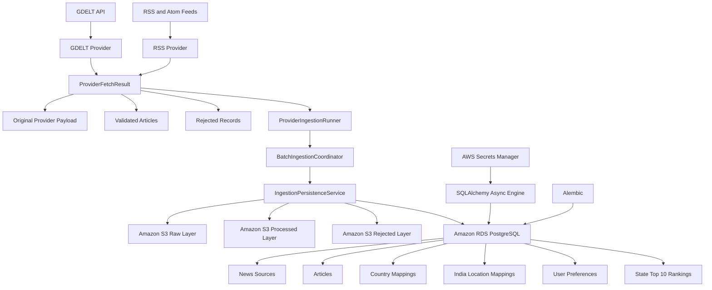
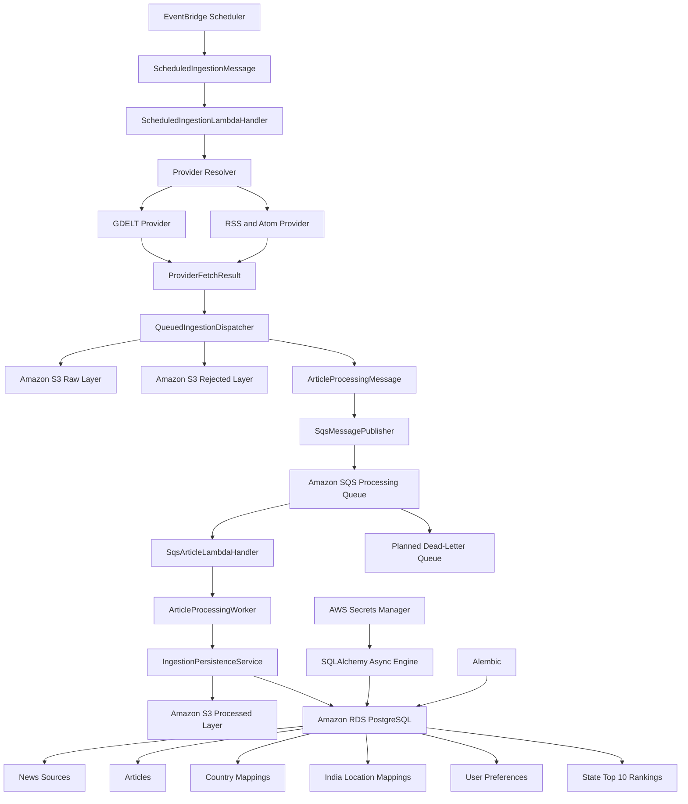
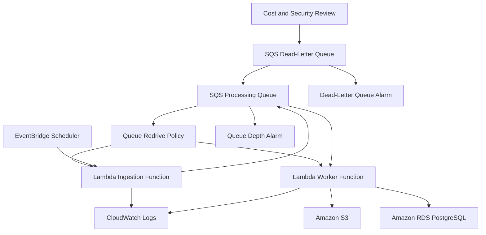

# World News AI

World News AI is a data engineering and artificial intelligence project that collects global news from multiple sources, processes and classifies articles, detects duplicate stories, identifies trending events, and provides searchable news through an API and dashboard.

The project is being developed step by step using production-style practices such as structured configuration, centralized logging, data validation, automated testing, documentation, and modular application design.

## Project Goals

* Collect current global news from multiple sources.
* Process both batch and streaming news data.
* Categorize articles into meaningful world-news categories.
* Detect duplicate and related articles.
* Generate concise AI summaries.
* Extract countries, organizations, people, and locations.
* Calculate trending and breaking-news scores.
* Provide full-text and semantic search.
* Display news analytics through an interactive dashboard.
* Allow users to copy headlines, summaries, and article links.
* Generate shareable social-media news cards.
* Build a production-style, monitored data pipeline.

## Primary News Categories

1. Politics & Diplomacy
2. Defence & Security
3. Conflict & Humanitarian
4. Economy & Business
5. Energy
6. Technology & AI
7. Health & Medicine
8. Science & Space
9. Climate & Environment
10. Disasters & Weather
11. Law & Governance
12. Society & Culture
13. Sports

Trending and Breaking are dynamic article labels rather than permanent news categories.

## Planned System Architecture

```text
News Sources
     |
     v
Data Ingestion
     |
     v
Raw News Storage
     |
     v
Data Cleaning and Validation
     |
     v
Duplicate Detection
     |
     v
News Classification
     |
     v
AI Summarization
     |
     v
Entity and Location Extraction
     |
     v
Trending and Breaking Scoring
     |
     v
Processed News Storage
     |
     +-------------------+
     |                   |
     v                   v
Search API         Analytics Dashboard
```

## Planned User Features

### News Dashboard

Users will be able to:

* Browse current world news.
* Search for articles.
* Filter by country.
* Filter by category.
* Filter by source.
* Filter by publication date.
* View AI-generated summaries.
* View related articles covering the same event.
* View trending and breaking-news labels.
* View news analytics and category trends.

### Copy Feature

Each article will provide options to copy:

* Headline
* AI summary
* Article link
* Headline and summary together
* Full formatted news content

Example copied content:

```text
Headline:
India announces a new renewable energy project

Summary:
The government announced a major renewable energy project intended to improve electricity generation and energy security.

Category:
Energy

Source:
Example News

Read more:
https://example.com/article
```

### Social-Media Card Feature

The application will support shareable social-media news cards containing:

* Headline
* Short summary
* Category
* Source
* Publication date
* Country or location
* Article image
* Share caption
* Article link

## Current Project Structure

```text
World_News_AI/
|
|-- docs/
|   |-- architecture.md
|   |-- step-02-configuration.md
|   |-- step-03-logging.md
|   `-- step-04-news-data-models.md
|
|-- logs/
|
|-- src/
|   |-- common/
|   |   |-- config.py
|   |   `-- logging_config.py
|   |
|   |-- models/
|   |   |-- __init__.py
|   |   |-- article.py
|   |   |-- country.py
|   |   |-- enums.py
|   |   `-- source.py
|   |
|   `-- main.py
|
|-- tests/
|   |-- fixtures/
|   |   `-- sample_article.json
|   |
|   `-- unit/
|       |-- test_config.py
|       |-- test_logging_config.py
|       `-- test_models.py
|
|-- .env.example
|-- .gitignore
|-- README.md
`-- requirements.txt
```

## Completed Development Steps

### Step 1: Project Foundation

The initial project structure was created with separate folders for:

* Application source code
* Unit tests
* Test fixtures
* Documentation
* Configuration
* Logs

### Step 2: Centralized Configuration

The project includes centralized configuration management for:

* Application environment
* Debug mode
* Logging settings
* Environment variables
* Default configuration values
* Configuration validation

Environment variables are loaded from a local `.env` file.

The `.env.example` file documents the required configuration fields without exposing real credentials.

### Step 3: Centralized Application Logging

The project includes centralized logging with:

* Console logging
* Rotating file logging
* Configurable log levels
* Configurable log file paths
* Application startup logging
* Prevention of duplicate log handlers
* Automated logging tests

The rotating file handler prevents application log files from growing without limits.

### Step 4: News Categories and Article Data Models

The project includes validated models for news data.

Implemented components include:

* Standard news categories
* Dynamic article labels
* Source-type definitions
* Sentiment labels
* ISO country-code normalization
* Country-name lookup
* News-source model
* Complete article model
* Social-media card model
* URL validation
* Publication date validation
* Keyword normalization
* Duplicate keyword removal
* Duplicate country-code removal
* Article JSON fixture
* Automated model validation tests

## Data Models

### NewsSource

The news-source model stores information such as:

* Source name
* Source type
* Homepage URL
* Country code
* Credibility score

Example source types include:

* RSS
* REST API
* Website
* Streaming source

### Article

The article model stores fields such as:

* Article ID
* Title
* Description
* Original article URL
* Image URL
* Source
* Author
* Publication time
* Primary category
* Article labels
* Sentiment
* Country codes
* Keywords
* AI summary
* Share caption

### SocialCardData

The social-media card model contains formatted data used to generate shareable news cards.

It can include:

* Headline
* Summary
* Category
* Source
* Country
* Image
* Publication date
* Share caption
* Article URL

## Article Validation

The models validate and normalize incoming news data.

Examples include:

```text
"in"       -> "IN"
" us "     -> "US"
```

Duplicate country codes are removed:

```text
["in", "US", "in"]
```

becomes:

```text
["IN", "US"]
```

Duplicate keywords are also removed without considering letter case:

```text
[
    "Renewable Energy",
    "India",
    "renewable energy"
]
```

becomes:

```text
[
    "Renewable Energy",
    "India"
]
```

## Installation

### 1. Clone the repository

```powershell
git clone <repository-url>
cd World_News_AI
```

### 2. Create a virtual environment

```powershell
python -m venv venv
```

### 3. Activate the virtual environment

Using PowerShell:

```powershell
.\venv\Scripts\Activate.ps1
```

After activation, the terminal should display:

```text
(venv)
```

### 4. Install dependencies

```powershell
python -m pip install -r requirements.txt
```

### 5. Create the local environment file

Copy `.env.example` to `.env`:

```powershell
Copy-Item .env.example .env
```

Update the `.env` file with local configuration values.

Do not commit the real `.env` file because it may contain API keys, passwords, or other secrets.

## Running the Application

Run the main application module from the project root:

```powershell
python -m src.main
```

This verifies that:

* Configuration loads correctly.
* Logging initializes correctly.
* Application startup messages are generated.

## Running Tests

Run all tests:

```powershell
python -m pytest -v
```

Run configuration tests:

```powershell
python -m pytest tests/unit/test_config.py -v
```

Run logging tests:

```powershell
python -m pytest tests/unit/test_logging_config.py -v
```

Run model tests:

```powershell
python -m pytest tests/unit/test_models.py -v
```

## Example Article Model

```python
from datetime import datetime, timezone

from src.models import (
    Article,
    ArticleLabel,
    NewsCategory,
    NewsSource,
    SentimentLabel,
    SourceType,
)

source = NewsSource(
    name="Reuters",
    source_type=SourceType.RSS,
    homepage_url="https://www.reuters.com",
    country_code="GB",
    credibility_score=95,
)

article = Article(
    title="India announces a new renewable energy project",
    description=(
        "The government announced a major project "
        "to improve renewable energy production."
    ),
    url="https://www.reuters.com/world/example-article",
    image_url="https://www.reuters.com/example-image.jpg",
    source=source,
    author="Example Reporter",
    published_at=datetime.now(timezone.utc),
    primary_category=NewsCategory.ENERGY,
    labels={
        ArticleLabel.BREAKING,
        ArticleLabel.TRENDING,
    },
    sentiment=SentimentLabel.NEUTRAL,
    country_codes=["IN", "US"],
    keywords=[
        "Renewable Energy",
        "India",
    ],
    share_caption=(
        "India announces a major renewable energy project."
    ),
)

print(article.model_dump_json(indent=2))
```

## Development Practices

The project follows these development practices:

* Modular Python source code
* Environment-based configuration
* Centralized application logging
* Strong data validation
* Automated unit testing
* Reusable data models
* Test fixtures
* Step-by-step technical documentation
* Git version control
* Clear commit history
* Separation of application code and tests

- Step 5: News-ingestion foundation
- Reusable asynchronous HTTP client
- Connection pooling and timeouts
- Automatic retry handling
- Project-specific ingestion exceptions
- Standard news-provider interface
- Live GDELT news provider
- GDELT response-to-Article mapping
- Mocked HTTP and provider tests

* Step 6: RSS and Atom news ingestion
* Validated feed-source registry
* Official NASA and JPL feed configurations
* Feed enable and disable controls
* RSS and Atom parsing with Feedparser
* HTML description and content cleaning
* Author, publication-date, and image extraction
* Query and timespan filtering
* Per-source article limits
* URL-based feed-entry deduplication
* RSS fixtures and automated tests

* Step 7: AWS storage foundation
* Private Amazon S3 data-lake bucket
* Raw, processed, rejected, curated, and social-card layers
* S3 public-access blocking, encryption, and versioning
* Provider, category, date, country, and state partitions
* Mocked S3 storage tests
* Encrypted Amazon RDS PostgreSQL database
* RDS credentials managed through AWS Secrets Manager
* PostgreSQL security-group access restricted to the developer IP
* Async SQLAlchemy and AsyncPG connection layer
* SSL-required RDS connections
* Database health check and connection tests

### Next Step

Create the PostgreSQL database schema and repository layer.

## Current Progress

Completed:

* Step 1: Project foundation and folder structure
* Step 2: Environment configuration and validation
* Step 3: Structured application logging
* Step 4: News article and provider data models
* Step 5: GDELT news ingestion
* Step 6: RSS and Atom news ingestion
* Step 7: AWS storage foundation
* Private Amazon S3 data-lake storage
* Raw, processed, rejected, curated, and social-card S3 layers
* Amazon RDS PostgreSQL database
* AWS Secrets Manager credential retrieval
* Async SQLAlchemy and AsyncPG database connection
* Step 8: Database schema, migrations, and repositories
* Fourteen PostgreSQL application tables
* Alembic schema migrations
* India catalog with 28 states and 8 Union Territories
* News-source and article repositories
* Country, state, district, and city mappings
* User preference storage
* Maximum two favorite countries per user
* Favorite Indian states
* Top 10 state-news ranking structure
* Unit tests and live Amazon RDS integration testing

## Current AWS Architecture

The project currently uses:

* Amazon S3 for raw, processed, rejected, curated, and social-card storage
* Amazon RDS PostgreSQL for structured application data
* AWS Secrets Manager for database credentials
* AWS IAM and AWS CLI profiles for development access
* Boto3 for AWS service integration
* SQLAlchemy and AsyncPG for asynchronous PostgreSQL operations
* Alembic for version-controlled database migrations

Planned AWS services include:

* AWS Lambda
* Amazon SQS
* EventBridge Scheduler
* AWS Glue
* Amazon Athena
* Amazon CloudWatch

## India News Features

The database foundation supports:

* A dedicated India News section
* Selection of a specific Indian state or Union Territory
* State-level article relevance
* Future district- and city-level filtering
* Favorite Indian states
* Top 10 news stories for every state
* Separate rankings by date, category, and ranking window

## Personalization Features

The project supports planned user personalization through:

* Selection of up to two favorite countries
* Favorite Indian states
* Future Top 10 trending stories for each selected country
* Future personalized country and state dashboards

## Project Progress

The World News AI project has completed Steps 1 through 9.

### Completed Steps

1. Project foundation and folder structure
2. Application configuration and environment management
3. Structured logging and shared utilities
4. Core news models and validation
5. GDELT news ingestion
6. RSS and Atom feed ingestion
7. AWS storage and PostgreSQL foundation
8. Database schema, migrations, repositories, and India location data
9. Provider-to-storage ingestion persistence pipeline

---

## Current Features

The project currently supports:

* GDELT news collection
* RSS and Atom feed collection
* Article validation and normalization
* Original provider-response preservation
* Raw news storage in Amazon S3
* Processed article storage in Amazon S3
* Rejected-record storage in Amazon S3
* PostgreSQL article persistence
* News-source creation and reuse
* Duplicate detection by URL
* Duplicate detection by content hash
* Country relevance mappings
* Indian-state relevance mappings
* Batch ingestion statistics
* Per-record failure handling
* Provider ingestion coordination
* Alembic database migrations
* India state and Union Territory seed data
* User favorite-country storage
* User favorite-state storage
* State Top 10 ranking storage
* Mocked unit testing without live AWS usage

---

## Current Architecture



---

## Step 9 Ingestion Flow

```text
News provider
    ↓
Original API or feed response
    ↓
Provider parsing and validation
    ├── Valid record → Article
    └── Invalid record → Rejected item
    ↓
ProviderIngestionRunner
    ↓
BatchIngestionCoordinator
    ↓
IngestionPersistenceService
    ├── Raw response → Amazon S3
    ├── Processed article → Amazon S3
    ├── Rejected record → Amazon S3
    ├── Article metadata → PostgreSQL
    ├── Country mappings → PostgreSQL
    └── Indian-state mappings → PostgreSQL
```

---

## India News Features

The current design includes:

* Dedicated India News section
* State and Union Territory catalog
* District and city database structure
* Article-to-state mappings
* Article-to-district mappings
* Article-to-city mappings
* Favorite Indian-state selection
* State-level news feeds
* Top 10 trending news storage for every Indian state

Automatic state, district, and city detection will be added in a later step.

---

## Personalization Features

The planned personalization flow includes:

* First-time user country selection
* Maximum of two favorite countries
* Favorite Indian-state selection
* Personalized country news feeds
* Top 10 trending news for each favorite country
* State-specific Top 10 news feeds

The database structures for these preferences are already implemented.

---

## AWS Services

| AWS service           | Current status              | Purpose                                                    |
| --------------------- | --------------------------- | ---------------------------------------------------------- |
| Amazon S3             | Implemented                 | Raw, processed, rejected, curated, and social-card storage |
| Amazon RDS PostgreSQL | Implemented                 | Application and news metadata                              |
| AWS Secrets Manager   | Implemented                 | PostgreSQL credentials                                     |
| AWS IAM               | Implemented for development | Controlled AWS access                                      |
| AWS Lambda            | Planned                     | Serverless ingestion and processing                        |
| Amazon SQS            | Planned                     | Decoupled article processing                               |
| EventBridge Scheduler | Planned                     | Scheduled ingestion                                        |
| Amazon CloudWatch     | Planned                     | Logs, metrics, and alarms                                  |
| AWS Glue              | Planned                     | Large-scale PySpark processing                             |
| Amazon Athena         | Planned                     | S3 data analysis                                           |

---

## Cost-Control Requirements

AWS cost control is mandatory for this project.

Current development rules:

* Keep RDS stopped when live database testing is not required
* Avoid NAT Gateways unless absolutely necessary
* Prefer serverless and pay-per-use services
* Avoid continuously running EC2 instances
* Use mocked unit tests before live AWS integration tests
* Verify that temporary resources are stopped or deleted
* Regularly check AWS Billing and Cost Explorer
* Remember that RDS storage charges continue while the instance is stopped
* Remember that AWS may automatically restart a stopped RDS instance after the maximum stop period

---

## Security Requirements

The project follows these security rules:

* Do not use the AWS root user for development
* Require MFA for root and administrative identities
* Use a named AWS CLI profile
* Do not store AWS access keys in project files
* Do not commit `.env`
* Do not store database passwords in source code
* Use AWS Secrets Manager for database credentials
* Keep Amazon S3 buckets private
* Review staged files before every Git commit
* Scan tracked files for credentials and secret ARNs

---

## Documentation

Detailed implementation documentation is available in:

text
docs/architecture.md
docs/step-07-aws-storage-foundation.md
docs/step-08-database-schema.md
docs/step-09-ingestion-persistence.md


---

## Testing

Run the complete unit-test suite:

powershell
python -m pytest tests\unit -v


Check all Python files:

powershell
python -m compileall -q 
  src 
  scripts 
  migrations 
  tests\unit


Verify Step 9 imports:

powershell
python -c "from src.services import IngestionPersistenceService, BatchIngestionCoordinator, ProviderIngestionRunner; print('Step 9 service imports successful')"


---

## Project Progress

The World News AI project has completed Steps 1 through 10.

### Completed Steps

1. Project foundation and folder structure
2. Application configuration and environment management
3. Structured logging and shared utilities
4. Core news models and validation
5. GDELT news ingestion
6. RSS and Atom feed ingestion
7. AWS storage and PostgreSQL foundation
8. Database schema, migrations, repositories, and India location data
9. Provider-to-storage ingestion persistence pipeline
10. Scheduled and decoupled ingestion application layer

---

## Current Features

The project currently supports:

- GDELT news collection
- RSS and Atom feed collection
- Original provider-response preservation
- Article validation and normalization
- Raw news storage in Amazon S3
- Processed article storage in Amazon S3
- Rejected-record storage in Amazon S3
- PostgreSQL article persistence
- News-source creation and reuse
- Duplicate detection by URL
- Duplicate detection by content hash
- Country relevance mappings
- Indian-state relevance mappings
- Batch ingestion statistics
- Per-record failure handling
- EventBridge-compatible message contracts
- SQS-compatible article-processing messages
- Amazon SQS publishing logic
- Standard and FIFO queue support
- Raw-first queued ingestion
- Lambda-compatible scheduled-ingestion handlers
- Lambda-compatible SQS handlers
- SQS partial batch failure responses
- Article-processing workers
- JSON message serialization and validation
- Message schema versioning
- Alembic database migrations
- India state and Union Territory seed data
- User favorite-country storage
- User favorite-state storage
- State Top 10 ranking storage
- Mocked testing without live AWS resources

---

## Current Architecture



---

## Step 10 Queued-Ingestion Flow

```text
EventBridge Scheduler
        ↓
ScheduledIngestionMessage
        ↓
ScheduledIngestionLambdaHandler
        ↓
Provider.fetch_batch()
        ↓
ProviderFetchResult
        ├── Original provider payload
        ├── Validated articles
        └── Rejected provider records
        ↓
QueuedIngestionDispatcher
        ├── Original payload → Amazon S3 raw layer
        ├── Rejected records → Amazon S3 rejected layer
        └── Valid articles → ArticleProcessingMessage
        ↓
SqsMessagePublisher
        ↓
Amazon SQS
        ↓
SqsArticleLambdaHandler
        ↓
ArticleProcessingWorker
        ↓
IngestionPersistenceService
        ├── Duplicate detection
        ├── Processed article → Amazon S3
        ├── Article → PostgreSQL
        ├── Country mappings
        └── Indian-state mappings
```

---

## Message Contracts

Step 10 provides two primary message contracts.

### Scheduled Ingestion Message

Used for:

```text
EventBridge Scheduler → Ingestion Lambda
```

Main fields:

```text
schema_version
message_id
created_at
provider
query
max_records
timespan
source_id
extra_partitions
```

### Article Processing Message

Used for:

```text
Ingestion Lambda → Amazon SQS → Worker Lambda
```

Main fields:

```text
schema_version
message_id
created_at
provider
raw_s3_uri
article_payload
country_scores
state_scores
primary_state_code
state_detection_method
retry_count
```

Message contracts are validated with Pydantic and support JSON serialization and deserialization.

---

## SQS Processing

The current application layer supports:

- Standard queues
- FIFO queues
- Message attributes
- Delay validation
- FIFO message-group IDs
- FIFO deduplication IDs
- Publishing-result validation
- Publishing-error conversion
- Partial batch failure responses
- Individual message retries
- Duplicate-safe article persistence

The initial AWS deployment is expected to use a standard queue because the article persistence layer already performs duplicate detection.

---

## Lambda-Compatible Handlers

The project includes application handlers for:

```text
EventBridge Scheduler
        ↓
ScheduledIngestionLambdaHandler
```

and:

```text
Amazon SQS
        ↓
SqsArticleLambdaHandler
```

The handlers are implemented independently from AWS deployment configuration so they can be tested locally.

---

## Partial Batch Failure Handling

The SQS handler returns an AWS-compatible response:

```json
{
  "batchItemFailures": [
    {
      "itemIdentifier": "failed-message-id"
    }
  ]
}
```

This allows only failed records to be retried.

Successful messages in the same Lambda invocation are not intentionally retried.

---

## India News Features

The current design includes:

- Dedicated India News section
- State and Union Territory catalog
- District and city database structure
- Article-to-state mappings
- Article-to-district mappings
- Article-to-city mappings
- Favorite Indian-state selection
- State-level news feeds
- Top 10 trending news storage for each Indian state

Automatic state, district, and city detection remains planned.

---

## Personalization Features

The planned personalization flow includes:

- First-time favorite-country selection
- Maximum of two favorite countries
- Favorite Indian-state selection
- Personalized country news feeds
- Top 10 trending news for each favorite country
- State-specific Top 10 news feeds

The required database structures are already implemented.

---

## AWS Services

| AWS service | Current status | Purpose |
|---|---|---|
| Amazon S3 | Application support implemented | Raw, processed, rejected, curated, and social-card storage |
| Amazon RDS PostgreSQL | Implemented | Application and news metadata |
| AWS Secrets Manager | Implemented | PostgreSQL credentials |
| AWS IAM | Development access configured | Controlled AWS access |
| Amazon SQS | Application code implemented; infrastructure not created | Decoupled article processing |
| AWS Lambda | Application handlers implemented; infrastructure not deployed | Scheduled ingestion and article processing |
| EventBridge Scheduler | Message contract implemented; schedule not created | Scheduled ingestion |
| Amazon CloudWatch | Planned | Logs, metrics, dashboards, and alarms |
| AWS Glue | Planned | Large-scale PySpark processing |
| Amazon Athena | Planned | S3 data analysis |

---

## AWS Deployment Status

The following application components are complete:

```text
Scheduled message contract
Article-processing message contract
SQS publisher
Queued-ingestion dispatcher
Article-processing worker
Scheduled Lambda-compatible handler
SQS Lambda-compatible handler
Partial batch failure response
```

The following AWS resources have not yet been created:

```text
SQS processing queue
SQS dead-letter queue
Lambda ingestion function
Lambda worker function
EventBridge schedule
Lambda IAM roles
SQS redrive policy
CloudWatch alarms
```

---

## Cost-Control Requirements

AWS cost control is mandatory.

Current rules:

- Keep RDS stopped when live database testing is not required
- Avoid NAT Gateway usage
- Prefer serverless and pay-per-use services
- Avoid continuously running EC2 instances
- Use mocked tests before live AWS integration
- Start with one development queue and one dead-letter queue
- Use conservative Lambda memory and timeout settings
- Use a low ingestion schedule frequency during testing
- Keep SQS batch sizes small initially
- Verify all temporary resources after testing
- Delete unused Lambda functions and queues
- Check AWS Billing and Cost Explorer regularly
- Remember that RDS storage charges continue while the instance is stopped
- Remember that AWS may restart a stopped RDS instance after the maximum stop period

---

## Security Requirements

The project follows these security rules:

- Do not use the AWS root user for routine development
- Require MFA for root and administrative identities
- Use least-privilege IAM roles
- Use a named AWS CLI profile
- Do not store AWS access keys in project files
- Do not commit `.env`
- Do not store database passwords in source code
- Use AWS Secrets Manager for database credentials
- Keep Amazon S3 buckets private
- Encrypt SQS queues
- Restrict SQS publishing to the required queue
- Restrict worker permissions to required resources
- Avoid logging secrets
- Configure a dead-letter queue before production use
- Review staged files before every Git commit

---

## Documentation

Detailed documentation is available in:

```text
docs/architecture.md
docs/step-07-aws-storage-foundation.md
docs/step-08-database-schema.md
docs/step-09-ingestion-persistence.md
docs/step-10-scheduled-decoupled-ingestion.md
```

---

## Testing

Run all Step 10 tests:

```powershell
python -m pytest `
  tests\unit\test_message_contracts.py `
  tests\unit\test_sqs_publisher.py `
  tests\unit\test_queued_ingestion_dispatcher.py `
  tests\unit\test_article_processing_worker.py `
  tests\unit\test_lambda_handlers.py `
  -v
```

Expected:

```text
33 passed
```

Run the complete unit-test suite:

```powershell
python -m pytest tests\unit -v
```

Compile the project:

```powershell
python -m compileall -q `
  src `
  scripts `
  migrations `
  tests\unit
```

Verify Step 10 imports:

```powershell
python -c "from src.messaging import ScheduledIngestionMessage, ArticleProcessingMessage, SqsMessagePublisher; from src.services import QueuedIngestionDispatcher, ArticleProcessingWorker; from src.lambda_handlers import ScheduledIngestionLambdaHandler, SqsArticleLambdaHandler; print('Step 10 imports successful')"
```

---

## Next Step

The next development stage is:

```text
Step 11 — AWS Queue and Lambda Infrastructure
```

Planned Step 11 flow:



Before Step 11 creates AWS resources, the implementation must:

- Estimate expected monthly cost
- Confirm the development AWS region
- Use one standard processing queue
- Use one dead-letter queue
- Avoid NAT Gateway usage
- Use least-privilege IAM roles
- Keep RDS stopped until a controlled database test
- Add deletion commands for every created resource
- Verify that no unexpected chargeable resource remains active