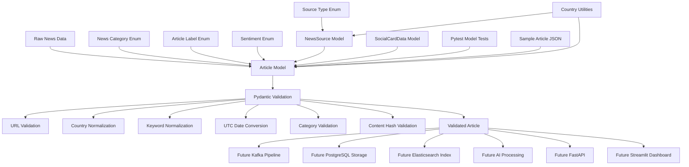

# World News AI Architecture

## Current Architecture — Step 1

```mermaid
flowchart TD
    A[Developer] --> B[Git Repository]
    B --> C[Python Virtual Environment]
    B --> D[Application Modules]
    B --> E[Tests]
    B --> F[Documentation]
    B --> G[Infrastructure Folders]

    D --> D1[Ingestion Module]
    D --> D2[Processing Module]
    D --> D3[AI Module]
    D --> D4[Database Module]
    D --> D5[Search Module]
    D --> D6[API Module]
    D --> D7[Common Module]

    G --> G1[Docker]
    G --> G2[Monitoring]
    G --> G3[Airflow]
    G --> G4[Spark]
    ## Current Architecture — Step 2

Step 2 added a centralized configuration layer.

```mermaid
flowchart TD
    A[.env.example] --> B[Local .env File]

    B --> C[src/common/config.py]

    C --> D[Pydantic Settings]
    D --> E[Load Environment Values]
    E --> F[Convert Data Types]
    F --> G[Validate Settings]
    G --> H[Cached Settings Object]

    H --> I[News Ingestion Module]
    H --> J[AI Module]
    H --> K[Database Module]
    H --> L[Kafka Processing]
    H --> M[Redis Cache]
    H --> N[Elasticsearch Search]
    H --> O[FastAPI Backend]
    H --> P[Streamlit Dashboard]

    Q[Pytest Configuration Tests] --> D

    ## Current Architecture — Step 3

Step 3 added centralized application logging.

```mermaid
flowchart TD
    A[src/main.py] --> B[Application Startup]

    B --> C[Central Logger]

    D[.env Logging Settings] --> C
    E[Pydantic Settings] --> C

    C --> F[Console Handler]
    C --> G[Rotating File Handler]

    F --> H[PowerShell or VS Code Terminal]

    G --> I[logs/world_news_ai.log]
    I --> J[Rotated Backup Files]

    K[Pytest Logging Tests] --> C
```

### Logging Configuration Flow

```text
.env
  ↓
LOG_LEVEL and LOG_FILE
  ↓
Pydantic Settings
  ↓
logging_config.py
  ↓
Central logger
```

### Runtime Logging Flow

```text
Application component
        ↓
Logger message
        ├── Terminal output
        └── Rotating log file
```

### Current Logging Components

The logging system currently includes:

* Central logger
* Configurable log level
* Configurable log-file location
* Console handler
* Rotating file handler
* Log formatting
* Automatic directory creation
* Duplicate-handler protection
* Application startup logging
* Automated unit tests

### Future Integration

The same logger will later be used by:

* News ingestion
* Kafka producers and consumers
* PySpark jobs
* AI processing
* PostgreSQL operations
* Redis operations
* Elasticsearch indexing
* FastAPI endpoints
* Streamlit dashboard
* Social-media card generation

## Current Architecture — Step 4

Step 4 added standardized news categories and validated article data models.



### Model Relationship

```text
NewsCategory
ArticleLabel
SentimentLabel
SourceType
Country utilities
        ↓
NewsSource
SocialCardData
        ↓
Article
        ↓
Validated application data
```

### Current Article Flow

```text
Article dictionary or JSON
        ↓
Pydantic Article model
        ↓
Validation and normalization
        ↓
Validated Article object
        ↓
JSON serialization or future processing
```

### Future Use

The same Article model will be used by:

* News ingestion
* Kafka messages
* PySpark processing
* AI classification
* AI summarization
* PostgreSQL
* Elasticsearch
* FastAPI
* Streamlit
* Social-card generation
