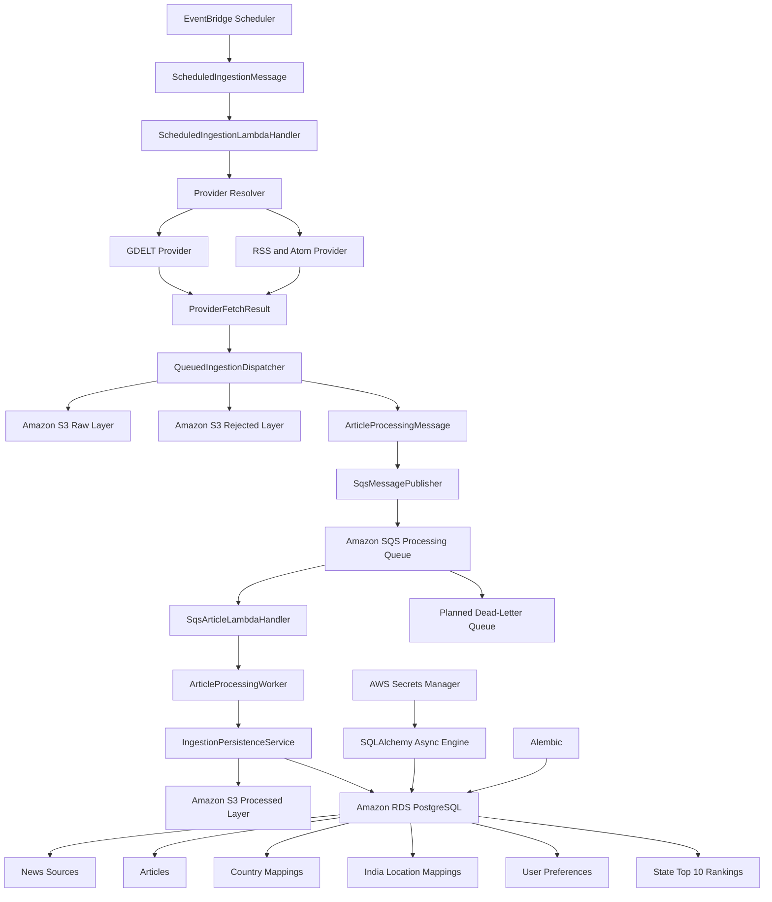
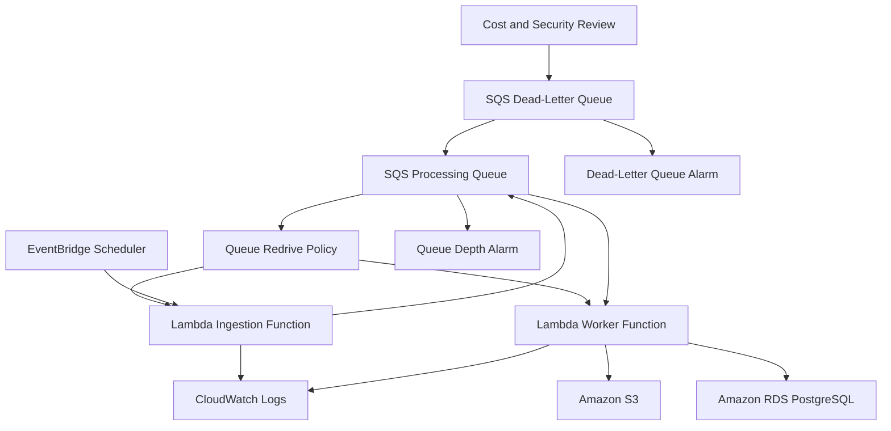

# World News AI Architecture

## Current Architecture — Step 1

 mermaid
flowchart TD
    A[Developer] --> B[Git Repository]
    B --> C[Python Virtual Environment]
    B --> D[Application Modules]
    B --> E[Tests]
    B --> F[Documentation]
    B --> G[Infrastructure Folders]

    D --> D1[Ingestion Module]
    D --> D2[Processing Module]
    D --> D3[AI Module]
    D --> D4[Database Module]
    D --> D5[Search Module]
    D --> D6[API Module]
    D --> D7[Common Module]

    G --> G1[Docker]
    G --> G2[Monitoring]
    G --> G3[Airflow]
    G --> G4[Spark]
    ## Current Architecture — Step 2

Step 2 added a centralized configuration layer.

 mermaid
flowchart TD
    A[.env.example] --> B[Local .env File]

    B --> C[src/common/config.py]

    C --> D[Pydantic Settings]
    D --> E[Load Environment Values]
    E --> F[Convert Data Types]
    F --> G[Validate Settings]
    G --> H[Cached Settings Object]

    H --> I[News Ingestion Module]
    H --> J[AI Module]
    H --> K[Database Module]
    H --> L[Kafka Processing]
    H --> M[Redis Cache]
    H --> N[Elasticsearch Search]
    H --> O[FastAPI Backend]
    H --> P[Streamlit Dashboard]

    Q[Pytest Configuration Tests] --> D

    ## Current Architecture — Step 3

Step 3 added centralized application logging.

 mermaid
flowchart TD
    A[src/main.py] --> B[Application Startup]

    B --> C[Central Logger]

    D[.env Logging Settings] --> C
    E[Pydantic Settings] --> C

    C --> F[Console Handler]
    C --> G[Rotating File Handler]

    F --> H[PowerShell or VS Code Terminal]

    G --> I[logs/world_news_ai.log]
    I --> J[Rotated Backup Files]

    K[Pytest Logging Tests] --> C
 

### Logging Configuration Flow

 text
.env
  ↓
LOG_LEVEL and LOG_FILE
  ↓
Pydantic Settings
  ↓
logging_config.py
  ↓
Central logger
 

### Runtime Logging Flow

 text
Application component
        ↓
Logger message
        ├── Terminal output
        └── Rotating log file
 

### Current Logging Components

The logging system currently includes:

* Central logger
* Configurable log level
* Configurable log-file location
* Console handler
* Rotating file handler
* Log formatting
* Automatic directory creation
* Duplicate-handler protection
* Application startup logging
* Automated unit tests

### Future Integration

The same logger will later be used by:

* News ingestion
* Kafka producers and consumers
* PySpark jobs
* AI processing
* PostgreSQL operations
* Redis operations
* Elasticsearch indexing
* FastAPI endpoints
* Streamlit dashboard
* Social-media card generation

## Current Architecture — Step 4

Step 4 added standardized news categories and validated article data models.

 mermaid
flowchart TD
    A[Raw News Data] --> B[Article Model]

    C[News Category Enum] --> B
    D[Article Label Enum] --> B
    E[Sentiment Enum] --> B
    F[Source Type Enum] --> G[NewsSource Model]
    H[Country Utilities] --> G
    H --> B

    G --> B
    I[SocialCardData Model] --> B

    B --> J[Pydantic Validation]

    J --> J1[URL Validation]
    J --> J2[Country Normalization]
    J --> J3[Keyword Normalization]
    J --> J4[UTC Date Conversion]
    J --> J5[Category Validation]
    J --> J6[Content Hash Validation]

    J --> K[Validated Article]

    K --> L[Future Kafka Pipeline]
    K --> M[Future PostgreSQL Storage]
    K --> N[Future Elasticsearch Index]
    K --> O[Future AI Processing]
    K --> P[Future FastAPI]
    K --> Q[Future Streamlit Dashboard]

    R[Pytest Model Tests] --> B
    S[Sample Article JSON] --> B
 

### Model Relationship

 text
NewsCategory
ArticleLabel
SentimentLabel
SourceType
Country utilities
        ↓
NewsSource
SocialCardData
        ↓
Article
        ↓
Validated application data
 

### Current Article Flow

 text
Article dictionary or JSON
        ↓
Pydantic Article model
        ↓
Validation and normalization
        ↓
Validated Article object
        ↓
JSON serialization or future processing
 

### Future Use

The same Article model will be used by:

* News ingestion
* Kafka messages
* PySpark processing
* AI classification
* AI summarization
* PostgreSQL
* Elasticsearch
* FastAPI
* Streamlit
* Social-card generation

## Current Architecture — Step 5

Step 5 added the reusable HTTP layer and the first external news provider.

 mermaid
flowchart TD
    A[GDELT Search Query] --> B[GdeltSearchRequest]

    B --> C[Validate Query]
    B --> D[Validate Record Limit]
    B --> E[Validate Timespan]

    C --> F[GdeltNewsProvider]
    D --> F
    E --> F

    F --> G[AsyncNewsHttpClient]

    H[HTTP Settings] --> G
    I[Logging System] --> G
    I --> F

    G --> J[HTTPX AsyncClient]
    J --> K[GDELT DOC API]

    K --> L[JSON Response]

    L --> M[Provider Response Validation]

    M --> N[Extract Article Records]
    N --> O[Map GDELT Fields]

    O --> P[NewsSource Model]
    O --> Q[Article Model]

    P --> R[Pydantic Validation]
    Q --> R

    R --> S[Validated Article List]

    T[HTTP Client Tests] --> G
    U[GDELT Provider Tests] --> F
    V[GDELT JSON Fixture] --> F
 

### HTTP Request Flow

 text
Provider
   ↓
AsyncNewsHttpClient
   ↓
Send HTTP request
   ↓
Timeout or network error?
   ├── Yes → Retry
   └── No
         ↓
Validate status
         ↓
Decode JSON or return text
 

### Provider Flow

 text
Search parameters
      ↓
Provider-specific request
      ↓
External news service
      ↓
Provider-specific response
      ↓
Standard Article objects
 

### Current Provider Support

 text
GDELT → Implemented
RSS   → Planned
News API → Planned
Other trusted feeds → Planned
 

### Future Integration

Validated articles will later move to:

* Raw article storage
* Kafka
* Duplicate detection
* PySpark processing
* PostgreSQL
* Elasticsearch
* AI classification
* AI summarization
* FastAPI
* Streamlit

## Current Architecture — Step 6

Step 6 added configurable RSS and Atom ingestion.

 mermaid
flowchart TD
    A[Feed Registry] --> B[Enabled Feed Source]

    B --> C[RssNewsProvider]

    D[Feed Source Configuration] --> C
    E[Optional Query] --> C
    F[Timespan and Record Limit] --> C

    C --> G[AsyncNewsHttpClient]
    G --> H[RSS or Atom Publisher]

    H --> I[XML Feed Response]
    I --> J[Feedparser]

    J --> K{Parsing Usable?}

    K -->|No entries| L[Provider Response Error]
    K -->|Usable entries| M[Process Feed Entries]

    M --> N[Extract Title and URL]
    M --> O[Clean Description and Content]
    M --> P[Extract Author and Image]
    M --> Q[Normalize Publication Date]

    N --> R[Article Model]
    O --> R
    P --> R
    Q --> R

    R --> S[Pydantic Validation]

    S --> T[URL Deduplication]
    T --> U[Timespan Filtering]
    U --> V[Query Filtering]
    V --> W[Source Record Limit]

    W --> X[Validated Article List]

    Y[RSS XML Fixture] --> C
    Z[Malformed Feed Fixture] --> C
    AA[Feed Registry Tests] --> A
    AB[RSS Provider Tests] --> C
 

### Feed Registry Flow

 text
Configured feed sources
        ↓
Registry validation
        ├── Unique source IDs
        └── Unique feed URLs
        ↓
Enabled feed sources
        ↓
RSS provider
 

### RSS Article Flow

 text
RSS or Atom XML
      ↓
Feedparser
      ↓
Normalized feed entry
      ↓
Field extraction
      ↓
Article validation
      ↓
Duplicate, date and query filtering
      ↓
Validated Article object
 

### Current Ingestion Sources

 text
GDELT           → Implemented
RSS and Atom    → Implemented
Additional APIs → Planned
 

### Future Storage Flow

 text
GDELT Articles ─┐
                ├── Validated Article objects
RSS Articles ───┘
                         ↓
               Future PostgreSQL storage
                         ↓
               Future Kafka and search layers
 
## Current Architecture — Step 7

Step 7 added the AWS storage and managed PostgreSQL foundation.

 mermaid
flowchart TD
    A[GDELT Provider] --> B[Validated and Raw News]
    C[RSS and Atom Providers] --> B

    B --> D[Amazon S3 Data Lake]

    D --> D1[Raw News]
    D --> D2[Processed News]
    D --> D3[Rejected News]
    D --> D4[Curated News]
    D --> D5[Social Cards]

    D1 --> E[Provider and Date Partitions]
    D2 --> F[Provider Category Country State Date Partitions]
    D3 --> G[Rejected Record and Reason]

    H[AWS CLI Profile or IAM Role] --> I[Boto3 Session]
    I --> D
    I --> J[AWS Secrets Manager]

    J --> K[RDS Master Credentials]

    K --> L[SQLAlchemy Async Engine]
    M[RDS Endpoint Configuration] --> L
    N[SSL Required] --> L

    L --> O[Amazon RDS PostgreSQL]

    O --> P[Future Sources Table]
    O --> Q[Future Articles Table]
    O --> R[Future India States and Districts]
    O --> S[Future Top 10 State Rankings]
    O --> T[Future User Preferences]

    U[S3 Unit Tests] --> D
    V[Database Unit Tests] --> L
 

### AWS Storage Flow

 text
News provider response
        ↓
Raw response stored in Amazon S3
        ↓
Article validation and processing
        ↓
Processed or rejected S3 layer
        ↓
Structured records in Amazon RDS
 

### Credential Flow

 text
Application
    ↓
Boto3 session
    ↓
AWS Secrets Manager
    ↓
RDS username and password
    ↓
SQLAlchemy AsyncPG connection
    ↓
Amazon RDS PostgreSQL
 

### India State-News Storage

 text
India article
    ↓
Location detection
    ├── Country
    ├── State
    ├── District
    └── City
    ↓
S3 location partitions
    ↓
RDS article-location mappings
    ↓
State relevance score
    ↓
Top 10 news for each state
 

### Current AWS Services

 text
Amazon S3             → Implemented
Amazon RDS PostgreSQL → Implemented
AWS Secrets Manager   → Implemented
AWS IAM profile       → Implemented for development
AWS Glue              → Planned
Amazon Athena         → Planned
AWS Lambda            → Planned
Amazon SQS            → Planned
EventBridge Scheduler → Planned
CloudWatch            → Planned
 
## Current Architecture — Step 8

Step 8 added the PostgreSQL schema, Alembic migrations, India location catalog, repository layer, user preferences, and state-level Top 10 ranking storage.

 mermaid
flowchart TD
    A[GDELT Provider] --> C[News Validation]
    B[RSS and Atom Providers] --> C

    C --> D[Amazon S3 Data Lake]
    C --> E[Database Repository Layer]

    D --> D1[Raw News]
    D --> D2[Processed News]
    D --> D3[Rejected News]
    D --> D4[Curated News]
    D --> D5[Social Cards]

    F[AWS Secrets Manager] --> G[SQLAlchemy Async Engine]
    G --> E

    E --> H[Amazon RDS PostgreSQL]

    H --> H1[News Sources]
    H --> H2[Articles]
    H --> H3[Article Countries]
    H --> H4[Indian States]
    H --> H5[Districts and Cities]
    H --> H6[User Preferences]
    H --> H7[State Top 10 Rankings]

    I[Alembic Migrations] --> H
    J[India Seed Script] --> H4

    K[Unit Tests] --> E
    L[Live Repository Test] --> H
 

### Database Persistence Flow

 text
Provider response
    ↓
Validation and normalization
    ↓
Create or reuse news source
    ↓
Detect duplicate article
    ↓
Store article in PostgreSQL
    ↓
Create country and state mappings
    ↓
Use articles in feeds and rankings
 

### India News Data Flow

 text
India article
    ↓
Country mapping: IN
    ↓
State relevance detection
    ↓
Article-state mapping
    ↓
State news feed
    ↓
Top 10 state ranking
 

### Personalization Flow

 text
Application user
    ├── Favorite country 1
    ├── Favorite country 2
    └── Favorite Indian states
            ↓
Personalized country and state news
 

### Database Tables

 text
news_sources
articles
article_labels
article_countries
indian_states
districts
cities
article_states
article_districts
article_cities
app_users
user_favorite_countries
user_favorite_states
state_news_rankings
 

### Repository Layer

 text
NewsSourceRepository
    └── News provider operations

ArticleRepository
    ├── Article persistence
    ├── Duplicate lookup
    ├── AI result updates
    └── Country and state mappings

IndiaLocationRepository
    ├── States and Union Territories
    ├── Districts
    └── Cities

UserPreferenceRepository
    ├── Application users
    ├── Two favorite countries
    └── Favorite Indian states

StateRankingRepository
    ├── Ranking validation
    ├── Top 10 replacement
    └── Ranked article retrieval
 

### Current AWS Services

 text
Amazon S3             → Implemented
Amazon RDS PostgreSQL → Implemented
AWS Secrets Manager   → Implemented
AWS IAM               → Implemented for development
AWS Lambda            → Planned
Amazon SQS            → Planned
EventBridge Scheduler → Planned
AWS Glue              → Planned
Amazon Athena         → Planned
Amazon CloudWatch     → Planned


### Next Architecture Stage

Step 9 will connect the provider ingestion layer to the AWS storage and repository layers.

text
GDELT, RSS, and Atom
        ↓
Ingestion persistence service
        ├── Raw payload → Amazon S3
        ├── Valid article → PostgreSQL
        ├── Processed JSON → Amazon S3
        └── Rejected record → Amazon S3

## Current Architecture — Step 9

Step 9 connects the GDELT, RSS, and Atom ingestion providers to Amazon S3 and PostgreSQL persistence.

 mermaid
flowchart TD
    A[GDELT API] --> B[GDELT Provider]
    C[RSS and Atom Feeds] --> D[RSS Provider]

    B --> E[ProviderFetchResult]
    D --> E

    E --> E1[Original Provider Payload]
    E --> E2[Validated Articles]
    E --> E3[Rejected Records]
    E --> E4[Received Record Count]

    E --> F[ProviderIngestionRunner]

    F --> G[ArticleIngestionRequest]
    F --> H[RejectedIngestionItem]

    G --> I[BatchIngestionCoordinator]
    H --> I
    E1 --> I

    I --> J[IngestionPersistenceService]

    J --> K[Amazon S3 Raw Layer]
    J --> L[Amazon S3 Processed Layer]
    J --> M[Amazon S3 Rejected Layer]
    J --> N[Amazon RDS PostgreSQL]

    N --> N1[News Sources]
    N --> N2[Articles]
    N --> N3[Country Mappings]
    N --> N4[Indian-State Mappings]

    O[AWS Secrets Manager] --> P[SQLAlchemy Async Engine]
    P --> N

    Q[Alembic Migrations] --> N
 

### Provider Layer

The provider layer collects the original provider response and converts valid records into shared `Article` models.

 text
GDELT API
    ↓
GdeltNewsProvider.fetch_batch()
    ├── Original JSON response
    ├── Valid Article models
    ├── Rejected records
    └── Received count
 

 text
RSS or Atom feed
    ↓
RssNewsProvider.fetch_batch()
    ├── Original XML response
    ├── Valid Article models
    ├── Rejected entries
    └── Received count
 

Both providers continue to support the older `fetch_articles()` method for backward compatibility.

### Provider Result Contract

The standardized provider result is defined in:

 text
src/ingestion/provider_result.py
 

The provider contract contains:

 text
ProviderFetchResult
    ├── provider_name
    ├── raw_payload
    ├── articles
    ├── received_count
    └── rejected_items
 

Each rejected provider record contains:

 text
ProviderRejectedItem
    ├── payload
    ├── reason
    ├── source_id
    └── extra_partitions
 

### Provider Ingestion Runner

The provider runner is defined in:

 text
src/services/provider_ingestion_runner.py
 

Its responsibilities are:

 text
Validate provider options
        ↓
Call fetch_batch()
        ↓
Fall back to fetch_articles() when needed
        ↓
Create ArticleIngestionRequest objects
        ↓
Create RejectedIngestionItem objects
        ↓
Send the batch to BatchIngestionCoordinator
 

The provider-run result contains:

 text
ProviderRunResult
    ├── provider_name
    ├── received_count
    ├── fetched_count
    ├── rejected_count
    └── batch_result
 

### Batch Ingestion Layer

The batch coordinator is defined in:

 text
src/services/batch_ingestion.py
 

The batch coordinator performs:

 text
Store raw provider response
        ↓
Process validated articles
        ↓
Store rejected records
        ↓
Calculate batch totals
        ↓
Return BatchIngestionResult
 

The batch result contains:

 text
BatchIngestionResult
    ├── provider
    ├── raw_s3_uri
    ├── total_received
    ├── stored_count
    ├── duplicate_count
    ├── rejected_count
    ├── failed_count
    ├── article_results
    ├── rejected_s3_uris
    └── errors
 

### Persistence Service

The article persistence service is defined in:

 text
src/services/ingestion_persistence.py
 

The persistence flow is:

 text
Validated Article
        ↓
Check duplicate URL
        ↓
Check duplicate content hash
        ↓
Create or reuse news source
        ↓
Store processed article in Amazon S3
        ↓
Store article record in PostgreSQL
        ↓
Store country mappings
        ↓
Store Indian-state mappings
 

### Amazon S3 Storage Layers

 text
Amazon S3
├── raw
│   ├── Original GDELT JSON
│   └── Original RSS and Atom XML
├── processed
│   └── Validated article JSON
├── rejected
│   └── Invalid provider records and reasons
├── curated
│   └── Planned analytics-ready datasets
└── social-cards
    └── Planned share-image assets
 

Each stored article can reference:

 text
raw_s3_uri
processed_s3_uri
 

### PostgreSQL Persistence

The ingestion pipeline writes to the following Step 8 tables:

 text
news_sources
articles
article_countries
article_states
 

Additional location and personalization tables remain available for later processing:

 text
indian_states
districts
cities
article_districts
article_cities
app_users
user_favorite_countries
user_favorite_states
state_news_rankings
 

### Duplicate Handling

Duplicate checks run in this order:

text
Article URL
    ↓
If no match
    ↓
Content hash


When a duplicate is detected:

text
Existing article returned
Processed S3 write skipped
PostgreSQL insert skipped
Country mappings skipped
State mappings skipped


### Rejected Record Handling

Invalid provider records are preserved rather than discarded.

text
Invalid provider record
        ↓
Validation or mapping failure
        ↓
ProviderRejectedItem
        ↓
RejectedIngestionItem
        ↓
Amazon S3 rejected layer


Examples include:

text
Missing title
Empty title
Invalid URL
Invalid publication date
Unexpected provider-record type
Unsupported date format
Pydantic validation failure


### Failure Behavior

A raw S3 storage failure stops the batch because the original provider response must be preserved first.

text
Raw storage failure
        ↓
Stop batch


An individual article failure does not stop the remaining articles.

text
Article 1 → Stored
Article 2 → Failed
Article 3 → Duplicate
Article 4 → Stored


Rejected-record storage failures are recorded without stopping the remaining rejected records.

### Country Mapping

The default article-request factory uses the provider source country.

text
source.country_code = IN
        ↓
country_scores = {"IN": 1.0000}
        ↓
article_countries


Country relevance scores must remain between zero and one.

### Indian-State Mapping

Optional Indian-state enrichment can be supplied to the persistence service.

text
state_scores = {
    "IN-TG": 0.9500
}

primary_state_code = "IN-TG"
state_detection_method = "keyword"


The mapping is stored in:

text
article_states


Automatic state, district, and city detection remains planned.

### Step 9 Service Structure

text
src/services/
├── __init__.py
├── batch_ingestion.py
├── ingestion_exceptions.py
├── ingestion_persistence.py
└── provider_ingestion_runner.py


### Step 9 Test Coverage

text
tests/unit/test_ingestion_persistence.py
tests/unit/test_batch_ingestion.py
tests/unit/test_provider_ingestion_runner.py
tests/unit/test_gdelt_provider.py
tests/unit/test_rss_raw_batch.py


The tests cover:

text
Raw payload storage
Processed article storage
Rejected-record storage
Duplicate detection
Source creation and reuse
Country mappings
Indian-state mappings
Batch counts
Failure handling
Provider-run coordination
GDELT raw JSON preservation
RSS and Atom raw XML preservation
Backward-compatible provider methods


### AWS Cost-Control Status

Step 9 unit tests use mocked S3 and PostgreSQL dependencies.

text
RDS required for unit tests      → No
Live S3 writes required          → No
Lambda required                  → No
SQS required                     → No
Glue required                    → No
NAT Gateway required             → No


Amazon RDS should remain stopped until a controlled live integration test is required.

### Next Architecture Stage

Step 10 will introduce scheduled and decoupled ingestion.

mermaid
flowchart TD
    A[EventBridge Scheduler] --> B[AWS Lambda Ingestion Trigger]
    B --> C[GDELT and RSS Providers]

    C --> D[Amazon S3 Raw Layer]
    C --> E[Amazon SQS]

    E --> F[Article Processing Worker]

    F --> G[Amazon S3 Processed Layer]
    F --> H[Amazon S3 Rejected Layer]
    F --> I[Amazon RDS PostgreSQL]

    B --> J[CloudWatch Logs and Metrics]
    F --> J


Before Step 10 AWS resources are created, the design must:

text
Estimate monthly cost risk
Use the lowest-cost practical configuration
Avoid NAT Gateway usage where possible
Avoid continuously running compute
Add shutdown and deletion commands
Verify that temporary resources are removed
Confirm that RDS remains stopped when not required

## Project Progress

The World News AI project has completed Steps 1 through 10.

### Completed Steps

1. Project foundation and folder structure
2. Application configuration and environment management
3. Structured logging and shared utilities
4. Core news models and validation
5. GDELT news ingestion
6. RSS and Atom feed ingestion
7. AWS storage and PostgreSQL foundation
8. Database schema, migrations, repositories, and India location data
9. Provider-to-storage ingestion persistence pipeline
10. Scheduled and decoupled ingestion application layer

---

## Current Features

The project currently supports:

- GDELT news collection
- RSS and Atom feed collection
- Original provider-response preservation
- Article validation and normalization
- Raw news storage in Amazon S3
- Processed article storage in Amazon S3
- Rejected-record storage in Amazon S3
- PostgreSQL article persistence
- News-source creation and reuse
- Duplicate detection by URL
- Duplicate detection by content hash
- Country relevance mappings
- Indian-state relevance mappings
- Batch ingestion statistics
- Per-record failure handling
- EventBridge-compatible message contracts
- SQS-compatible article-processing messages
- Amazon SQS publishing logic
- Standard and FIFO queue support
- Raw-first queued ingestion
- Lambda-compatible scheduled-ingestion handlers
- Lambda-compatible SQS handlers
- SQS partial batch failure responses
- Article-processing workers
- JSON message serialization and validation
- Message schema versioning
- Alembic database migrations
- India state and Union Territory seed data
- User favorite-country storage
- User favorite-state storage
- State Top 10 ranking storage
- Mocked testing without live AWS resources

---

## Current Architecture



---

## Step 10 Queued-Ingestion Flow

```text
EventBridge Scheduler
        ↓
ScheduledIngestionMessage
        ↓
ScheduledIngestionLambdaHandler
        ↓
Provider.fetch_batch()
        ↓
ProviderFetchResult
        ├── Original provider payload
        ├── Validated articles
        └── Rejected provider records
        ↓
QueuedIngestionDispatcher
        ├── Original payload → Amazon S3 raw layer
        ├── Rejected records → Amazon S3 rejected layer
        └── Valid articles → ArticleProcessingMessage
        ↓
SqsMessagePublisher
        ↓
Amazon SQS
        ↓
SqsArticleLambdaHandler
        ↓
ArticleProcessingWorker
        ↓
IngestionPersistenceService
        ├── Duplicate detection
        ├── Processed article → Amazon S3
        ├── Article → PostgreSQL
        ├── Country mappings
        └── Indian-state mappings
```

---

## Message Contracts

Step 10 provides two primary message contracts.

### Scheduled Ingestion Message

Used for:

```text
EventBridge Scheduler → Ingestion Lambda
```

Main fields:

```text
schema_version
message_id
created_at
provider
query
max_records
timespan
source_id
extra_partitions
```

### Article Processing Message

Used for:

```text
Ingestion Lambda → Amazon SQS → Worker Lambda
```

Main fields:

```text
schema_version
message_id
created_at
provider
raw_s3_uri
article_payload
country_scores
state_scores
primary_state_code
state_detection_method
retry_count
```

Message contracts are validated with Pydantic and support JSON serialization and deserialization.

---

## SQS Processing

The current application layer supports:

- Standard queues
- FIFO queues
- Message attributes
- Delay validation
- FIFO message-group IDs
- FIFO deduplication IDs
- Publishing-result validation
- Publishing-error conversion
- Partial batch failure responses
- Individual message retries
- Duplicate-safe article persistence

The initial AWS deployment is expected to use a standard queue because the article persistence layer already performs duplicate detection.

---

## Lambda-Compatible Handlers

The project includes application handlers for:

```text
EventBridge Scheduler
        ↓
ScheduledIngestionLambdaHandler
```

and:

```text
Amazon SQS
        ↓
SqsArticleLambdaHandler
```

The handlers are implemented independently from AWS deployment configuration so they can be tested locally.

---

## Partial Batch Failure Handling

The SQS handler returns an AWS-compatible response:

```json
{
  "batchItemFailures": [
    {
      "itemIdentifier": "failed-message-id"
    }
  ]
}
```

This allows only failed records to be retried.

Successful messages in the same Lambda invocation are not intentionally retried.

---

## India News Features

The current design includes:

- Dedicated India News section
- State and Union Territory catalog
- District and city database structure
- Article-to-state mappings
- Article-to-district mappings
- Article-to-city mappings
- Favorite Indian-state selection
- State-level news feeds
- Top 10 trending news storage for each Indian state

Automatic state, district, and city detection remains planned.

---

## Personalization Features

The planned personalization flow includes:

- First-time favorite-country selection
- Maximum of two favorite countries
- Favorite Indian-state selection
- Personalized country news feeds
- Top 10 trending news for each favorite country
- State-specific Top 10 news feeds

The required database structures are already implemented.

---

## AWS Services

| AWS service | Current status | Purpose |
|---|---|---|
| Amazon S3 | Application support implemented | Raw, processed, rejected, curated, and social-card storage |
| Amazon RDS PostgreSQL | Implemented | Application and news metadata |
| AWS Secrets Manager | Implemented | PostgreSQL credentials |
| AWS IAM | Development access configured | Controlled AWS access |
| Amazon SQS | Application code implemented; infrastructure not created | Decoupled article processing |
| AWS Lambda | Application handlers implemented; infrastructure not deployed | Scheduled ingestion and article processing |
| EventBridge Scheduler | Message contract implemented; schedule not created | Scheduled ingestion |
| Amazon CloudWatch | Planned | Logs, metrics, dashboards, and alarms |
| AWS Glue | Planned | Large-scale PySpark processing |
| Amazon Athena | Planned | S3 data analysis |

---

## AWS Deployment Status

The following application components are complete:

```text
Scheduled message contract
Article-processing message contract
SQS publisher
Queued-ingestion dispatcher
Article-processing worker
Scheduled Lambda-compatible handler
SQS Lambda-compatible handler
Partial batch failure response
```

The following AWS resources have not yet been created:

```text
SQS processing queue
SQS dead-letter queue
Lambda ingestion function
Lambda worker function
EventBridge schedule
Lambda IAM roles
SQS redrive policy
CloudWatch alarms
```

---

## Cost-Control Requirements

AWS cost control is mandatory.

Current rules:

- Keep RDS stopped when live database testing is not required
- Avoid NAT Gateway usage
- Prefer serverless and pay-per-use services
- Avoid continuously running EC2 instances
- Use mocked tests before live AWS integration
- Start with one development queue and one dead-letter queue
- Use conservative Lambda memory and timeout settings
- Use a low ingestion schedule frequency during testing
- Keep SQS batch sizes small initially
- Verify all temporary resources after testing
- Delete unused Lambda functions and queues
- Check AWS Billing and Cost Explorer regularly
- Remember that RDS storage charges continue while the instance is stopped
- Remember that AWS may restart a stopped RDS instance after the maximum stop period

---

## Security Requirements

The project follows these security rules:

- Do not use the AWS root user for routine development
- Require MFA for root and administrative identities
- Use least-privilege IAM roles
- Use a named AWS CLI profile
- Do not store AWS access keys in project files
- Do not commit `.env`
- Do not store database passwords in source code
- Use AWS Secrets Manager for database credentials
- Keep Amazon S3 buckets private
- Encrypt SQS queues
- Restrict SQS publishing to the required queue
- Restrict worker permissions to required resources
- Avoid logging secrets
- Configure a dead-letter queue before production use
- Review staged files before every Git commit

---

## Documentation

Detailed documentation is available in:

```text
docs/architecture.md
docs/step-07-aws-storage-foundation.md
docs/step-08-database-schema.md
docs/step-09-ingestion-persistence.md
docs/step-10-scheduled-decoupled-ingestion.md
```

---

## Testing

Run all Step 10 tests:

```powershell
python -m pytest `
  tests\unit\test_message_contracts.py `
  tests\unit\test_sqs_publisher.py `
  tests\unit\test_queued_ingestion_dispatcher.py `
  tests\unit\test_article_processing_worker.py `
  tests\unit\test_lambda_handlers.py `
  -v
```

Expected:

```text
33 passed
```

Run the complete unit-test suite:

```powershell
python -m pytest tests\unit -v
```

Compile the project:

```powershell
python -m compileall -q `
  src `
  scripts `
  migrations `
  tests\unit
```

Verify Step 10 imports:

```powershell
python -c "from src.messaging import ScheduledIngestionMessage, ArticleProcessingMessage, SqsMessagePublisher; from src.services import QueuedIngestionDispatcher, ArticleProcessingWorker; from src.lambda_handlers import ScheduledIngestionLambdaHandler, SqsArticleLambdaHandler; print('Step 10 imports successful')"
```

---

## Next Step

The next development stage is:

```text
Step 11 — AWS Queue and Lambda Infrastructure
```

Planned Step 11 flow:



Before Step 11 creates AWS resources, the implementation must:

- Estimate expected monthly cost
- Confirm the development AWS region
- Use one standard processing queue
- Use one dead-letter queue
- Avoid NAT Gateway usage
- Use least-privilege IAM roles
- Keep RDS stopped until a controlled database test
- Add deletion commands for every created resource
- Verify that no unexpected chargeable resource remains active
