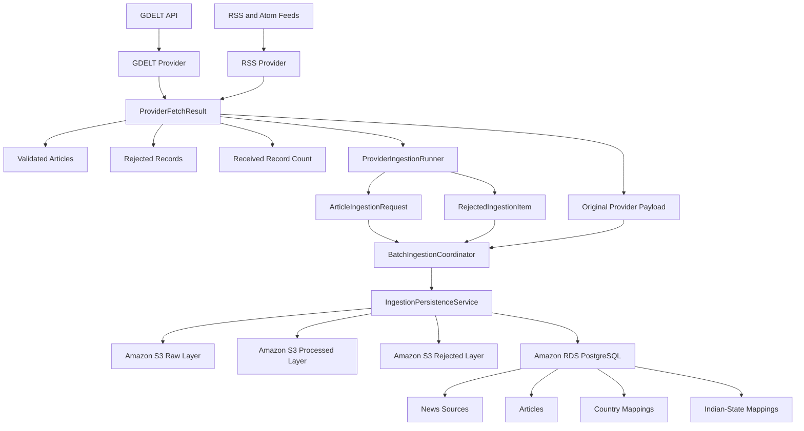

# Step 9 — Ingestion Persistence Pipeline

## Objective

Step 9 connects the news-provider ingestion layer to the AWS storage and PostgreSQL persistence layers.

The pipeline now supports:

* Original provider-response storage
* Validated article persistence
* Rejected-record storage
* Duplicate detection
* News-source creation and reuse
* Country relevance mappings
* Indian-state relevance mappings
* Batch-level processing statistics
* Failure handling without stopping the entire batch
* GDELT, RSS, and Atom provider integration

---

## High-Level Architecture



---

## Complete Ingestion Flow

```text
Provider API or feed
        ↓
Fetch original response
        ↓
Parse provider records
        ├── Valid record → Article model
        └── Invalid record → Rejected item
        ↓
ProviderFetchResult
        ├── Raw provider payload
        ├── Validated Article models
        ├── Rejected records
        └── Received count
        ↓
ProviderIngestionRunner
        ↓
BatchIngestionCoordinator
        ├── Save original response to S3
        ├── Persist validated articles
        ├── Store rejected records
        └── Calculate batch totals
        ↓
IngestionPersistenceService
        ├── Detect duplicate URL
        ├── Detect duplicate content hash
        ├── Create or reuse news source
        ├── Save processed article to S3
        ├── Save article to PostgreSQL
        ├── Save country mappings
        └── Save Indian-state mappings
```

---

## New Service Layer

The following service package was introduced:

```text
src/services/
├── __init__.py
├── batch_ingestion.py
├── ingestion_exceptions.py
├── ingestion_persistence.py
└── provider_ingestion_runner.py
```

---

## Ingestion Persistence Service

File:

```text
src/services/ingestion_persistence.py
```

The `IngestionPersistenceService` coordinates Amazon S3 storage and PostgreSQL persistence for individual articles.

### Responsibilities

* Store original provider payloads in the S3 raw layer
* Store invalid provider records in the S3 rejected layer
* Detect duplicate articles by URL
* Detect duplicate articles by content hash
* Create or reuse a news-source record
* Store processed article JSON in S3
* Store article metadata in PostgreSQL
* Create article-country mappings
* Create article-state mappings
* Return a structured persistence result

### Persistence Status

```text
stored
duplicate
```

The service returns an `ArticlePersistenceResult` containing:

```text
status
article_id
raw_s3_uri
processed_s3_uri
source_created
duplicate_reason
```

---

## Duplicate Detection

Before a new article is saved, the service checks:

```text
Article URL
    ↓
If not found
    ↓
Article content hash
```

If a match is found, the existing article is returned as a duplicate.

Duplicate articles are not written again to:

* PostgreSQL
* The processed S3 layer
* Country mappings
* Indian-state mappings

This prevents unnecessary storage, duplicated news results, and repeated processing costs.

---

## Raw Payload Storage

The original provider response is stored before article persistence begins.

```text
Original GDELT JSON
        ↓
Amazon S3 raw layer
```

```text
Original RSS or Atom XML
        ↓
Amazon S3 raw layer
```

Each persisted article keeps a reference to the raw S3 object:

```text
raw_s3_uri
```

This supports:

* Auditability
* Reprocessing
* Debugging
* Data recovery
* Provider-response comparison
* Future analytics processing

A raw-storage failure stops the batch because the original provider response must be preserved before processed records are saved.

---

## Processed Article Storage

Each validated article is converted into the shared `Article` model.

The processed article is stored in the S3 processed layer before the final PostgreSQL record is completed.

```text
Validated Article
        ↓
Serialized article JSON
        ↓
Amazon S3 processed layer
        ↓
processed_s3_uri stored in PostgreSQL
```

---

## Rejected Payload Storage

Invalid provider records are not silently discarded.

They are converted into rejected-ingestion items containing:

```text
payload
reason
source_id
extra_partitions
```

The rejected item is then stored in the S3 rejected layer.

```text
Invalid provider record
        ↓
Validation or mapping error
        ↓
RejectedIngestionItem
        ↓
Amazon S3 rejected layer
```

Examples of rejection reasons include:

* Missing title
* Empty title
* Invalid URL
* Missing publication date
* Invalid provider record type
* Unsupported date format
* Pydantic model validation error

---

## Batch Ingestion Coordinator

File:

```text
src/services/batch_ingestion.py
```

The `BatchIngestionCoordinator` processes one complete provider response.

### Batch Inputs

```text
provider
raw_payload
article_requests
rejected_items
source_id
query
raw_extra_partitions
```

### Batch Processing

```text
Store raw provider payload
        ↓
Process each validated article
        ↓
Store each rejected record
        ↓
Calculate stored, duplicate, rejected, and failed totals
        ↓
Return BatchIngestionResult
```

### Batch Result

The `BatchIngestionResult` contains:

```text
provider
raw_s3_uri
total_received
stored_count
duplicate_count
rejected_count
failed_count
article_results
rejected_s3_uris
errors
```

### Failure Behavior

An individual article failure does not stop the remaining batch.

```text
Article 1 → Stored
Article 2 → Failed
Article 3 → Duplicate
Article 4 → Stored
```

The final result records:

```text
stored_count = 2
duplicate_count = 1
failed_count = 1
```

A rejected-record storage failure is also recorded without stopping the remaining rejected records.

---

## Provider Ingestion Runner

File:

```text
src/services/provider_ingestion_runner.py
```

The `ProviderIngestionRunner` connects providers to the batch coordinator.

### Responsibilities

* Validate provider name
* Validate maximum record count
* Validate timespan
* Call `fetch_batch()` when supported
* Fall back to `fetch_articles()` for older providers
* Convert articles into `ArticleIngestionRequest` objects
* Convert provider rejections into `RejectedIngestionItem` objects
* Submit the complete provider batch
* Return provider-run statistics

### Provider Run Result

```text
provider_name
received_count
fetched_count
rejected_count
batch_result
```

---

## Backward Compatibility

Providers supporting only:

```python
fetch_articles()
```

remain compatible.

For these providers, the runner creates a structured snapshot:

```text
provider
query
max_records
timespan
validated_count
validated_articles
```

Providers supporting:

```python
fetch_batch()
```

can supply the exact original provider response and rejected records.

---

## Provider Result Contract

File:

```text
src/ingestion/provider_result.py
```

The `ProviderFetchResult` contract standardizes provider output.

### ProviderFetchResult

```text
provider_name
raw_payload
articles
received_count
rejected_items
```

### ProviderRejectedItem

```text
payload
reason
source_id
extra_partitions
```

The result validates that:

* Provider name is not empty
* Received count is not negative
* Received count is not smaller than validated and rejected totals

---

## GDELT Raw-Batch Support

File:

```text
src/ingestion/providers/gdelt.py
```

The GDELT provider now exposes:

```python
fetch_batch()
```

### GDELT Processing Flow

```text
GDELT JSON response
        ↓
Validate top-level response
        ↓
Extract articles list
        ↓
Process every provider record
        ├── Valid → Article
        └── Invalid → ProviderRejectedItem
        ↓
Return ProviderFetchResult
```

### Preserved GDELT Data

The exact JSON response returned by the GDELT API is retained as:

```text
raw_payload
```

### GDELT Validations

The provider validates:

* Query length
* Maximum record count
* Timespan format
* Minimum minute timespan
* Top-level JSON type
* Presence of the articles field
* Articles field type
* Article title
* Article URL
* Seen date
* Source domain
* Language
* Source country

### Timespan Normalization

Uppercase values are normalized before validation.

```text
24H → 24h
7D  → 7d
```

---

## RSS and Atom Raw-Batch Support

File:

```text
src/ingestion/providers/rss.py
```

The same provider supports both RSS and Atom feeds.

It now exposes:

```python
fetch_batch()
```

### RSS and Atom Processing Flow

```text
Original XML response
        ↓
feedparser
        ↓
Feed format validation
        ↓
Entry mapping
        ├── Valid → Article
        ├── Invalid → ProviderRejectedItem
        ├── Duplicate → Skipped
        └── Filtered → Skipped
        ↓
Return ProviderFetchResult
```

### Raw Feed Payload

The raw payload contains:

```text
source_id
source_name
feed_url
feed_version
query
timespan
content_length
content
```

The `content` field stores the original RSS or Atom XML text.

### Feed Entry Validation

Each entry is checked for:

* Valid title
* Valid link
* Publication date
* Optional description
* Optional content
* Optional author
* Optional image
* Query match
* Timespan match
* Duplicate URL

Invalid entries are retained in the rejected layer instead of being discarded.

---

## Country Mapping

The default article-request factory creates a country mapping from the source country.

Example:

```text
source.country_code = IN
        ↓
country_scores = {"IN": 1.0000}
```

The mapping is stored in:

```text
article_countries
```

Country relevance scores must be between:

```text
0 and 1
```

---

## Indian-State Mapping

The persistence service supports optional state enrichment.

Example:

```text
state_scores = {
    "IN-TG": 0.9500
}

primary_state_code = "IN-TG"
state_detection_method = "keyword"
```

The mapping is stored in:

```text
article_states
```

The primary state must exist in the supplied state-score mapping.

State detection can later be provided through:

* Keyword detection
* Named-entity recognition
* AI classification
* District mapping
* City mapping
* Provider metadata

---

## Persistence Exceptions

File:

```text
src/services/ingestion_exceptions.py
```

The Step 9 service layer uses the following exception hierarchy:

```text
IngestionPersistenceError
├── RawPayloadPersistenceError
├── ArticlePersistenceError
└── RejectedPayloadPersistenceError
```

These exceptions provide operation-specific error messages while preserving the original exception through exception chaining.

---

## Unit Tests

Step 9 added and expanded tests for:

```text
tests/unit/test_ingestion_persistence.py
tests/unit/test_batch_ingestion.py
tests/unit/test_provider_ingestion_runner.py
tests/unit/test_gdelt_provider.py
tests/unit/test_rss_raw_batch.py
```

### Persistence Tests

The persistence tests verify:

* Raw S3 storage delegation
* Successful article persistence
* Source creation and reuse
* Processed S3 storage
* PostgreSQL article creation
* Country mappings
* Indian-state mappings
* Duplicate URL detection
* Duplicate content-hash detection
* Raw-storage exception conversion
* Article-persistence exception conversion
* Relevance-score validation

### Batch Tests

The batch tests verify:

* Stored article counting
* Duplicate counting
* Rejected-record counting
* Article failure handling
* Rejected-storage failure handling
* Raw-storage failure behavior
* Empty-batch behavior

### Provider Runner Tests

The provider-runner tests verify:

* Raw-capable provider support
* Legacy provider fallback
* Original raw-payload forwarding
* Rejected-record forwarding
* Custom article-request factories
* Country mapping
* Input validation

### GDELT Tests

The GDELT tests verify:

* Search-request validation
* Timespan normalization
* Raw JSON preservation
* Valid article mapping
* Rejected-record retention
* Missing articles-field handling
* Invalid top-level response handling
* Invalid articles-field handling
* Backward-compatible `fetch_articles()`

### RSS and Atom Tests

The feed tests verify:

* Timespan normalization
* Original XML preservation
* Valid article mapping
* Invalid-entry retention
* Query filtering
* Backward-compatible `fetch_articles()`

---

## Verification Commands

Run the Step 9 tests:

```powershell
python -m pytest `
  tests\unit\test_ingestion_persistence.py `
  tests\unit\test_batch_ingestion.py `
  tests\unit\test_provider_ingestion_runner.py `
  tests\unit\test_gdelt_provider.py `
  tests\unit\test_rss_raw_batch.py `
  -v
```

Run the complete unit-test suite:

```powershell
python -m pytest tests\unit -v
```

Check all Python files:

```powershell
python -m compileall -q `
  src `
  scripts `
  migrations `
  tests\unit
```

Verify provider raw-batch support:

```powershell
python -c "from src.ingestion.providers.gdelt import GdeltNewsProvider; from src.ingestion.providers.rss import RssNewsProvider; print('GDELT fetch_batch:', hasattr(GdeltNewsProvider, 'fetch_batch')); print('RSS fetch_batch:', hasattr(RssNewsProvider, 'fetch_batch'))"
```

Expected:

```text
GDELT fetch_batch: True
RSS fetch_batch: True
```

Verify Step 9 service imports:

```powershell
python -c "from src.services import IngestionPersistenceService, BatchIngestionCoordinator, ProviderIngestionRunner; print('Step 9 service imports successful')"
```

Expected:

```text
Step 9 service imports successful
```

---

## AWS Cost Control

Step 9 unit tests use mocked S3 and repository dependencies.

Therefore:

* RDS does not need to be running
* No live S3 writes are required
* No Lambda resources are required
* No SQS resources are required
* No Glue jobs are required
* No NAT Gateway is required

The RDS instance should remain stopped when live integration testing is not being performed.

Check RDS status:

```powershell
aws rds describe-db-instances `
  --db-instance-identifier "world-news-postgres-dev" `
  --profile "world-news-dev" `
  --region "us-east-1" `
  --query "DBInstances[0].DBInstanceStatus" `
  --output text
```

Expected:

```text
stopped
```

An RDS instance stopped through AWS can automatically restart after the maximum AWS stop period. Its status and billing should therefore be checked regularly.

Storage charges can continue while the database is stopped.

---

## Security Controls

Step 9 maintains the following security requirements:

* No AWS credentials are stored in source code
* No database password is stored in source code
* `.env` remains excluded from Git
* Secrets Manager is used for PostgreSQL credentials
* S3 objects remain private
* Provider payloads are not publicly exposed
* Rejected records are stored for controlled debugging
* Error logs do not intentionally expose secret values
* AWS access uses the named development profile
* Root credentials are not used for routine development

---

## Current Limitations

Step 9 does not yet provide:

* Scheduled ingestion
* SQS-based decoupling
* Lambda deployment
* Retry queues
* Dead-letter queues
* Distributed batch processing
* Automatic Indian-state detection
* District and city detection
* AI summarization
* AI categorization
* Sentiment analysis
* Trending-score calculation
* State Top 10 calculation
* Country Top 10 calculation
* CloudWatch dashboards and alarms
* Production integration tests against live S3 and RDS

These capabilities remain planned for later steps.

---

## Step 9 Completion Status

Step 9 now provides the complete local ingestion-persistence pipeline:

```text
Provider
    ↓
Original response
    ↓
Validation and rejection handling
    ↓
Provider ingestion runner
    ↓
Batch coordinator
    ↓
Persistence service
    ├── Amazon S3 raw layer
    ├── Amazon S3 processed layer
    ├── Amazon S3 rejected layer
    └── PostgreSQL repositories
```

---

## Next Step

The next stage is:

```text
Step 10 — Scheduled and Decoupled Ingestion
```

Planned Step 10 components:

```text
EventBridge Scheduler
        ↓
AWS Lambda ingestion trigger
        ↓
Amazon SQS
        ↓
Article-processing worker
        ↓
S3 and PostgreSQL persistence
        ↓
CloudWatch logs and metrics
```

Before creating any chargeable AWS resources, the implementation must:

* Estimate the cost risk
* Use the lowest-cost practical configuration
* Avoid NAT Gateway usage where possible
* Avoid continuously running compute
* Include resource shutdown and deletion verification
* Confirm RDS remains stopped when not needed
