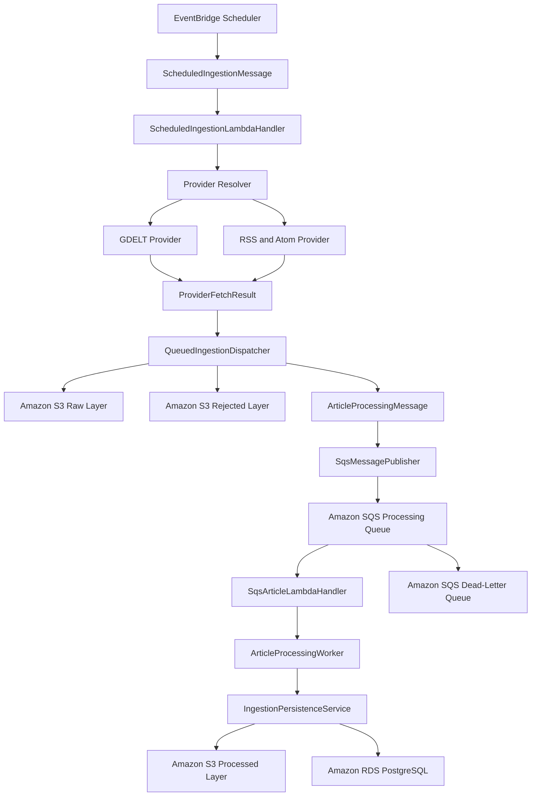

# Step 10 — Scheduled and Decoupled Ingestion

## Objective

Step 10 introduces the application layer required for scheduled and decoupled news ingestion.

The design separates provider collection from article persistence by using structured messages and Amazon SQS-compatible processing.

The implementation currently supports:

- EventBridge-compatible ingestion messages
- SQS-compatible article-processing messages
- Message schema versioning
- Amazon SQS publishing
- Raw provider-response storage before queue publishing
- Validated article dispatching
- Rejected-record storage
- Individual article-processing workers
- Lambda-compatible scheduled-ingestion handlers
- Lambda-compatible SQS batch handlers
- Partial batch failure responses
- Mocked unit testing without live AWS resources

No EventBridge Scheduler, Lambda function, SQS queue, or dead-letter queue has been created in AWS during this step.

---

## High-Level Architecture



The current code implements the application components represented in this architecture.

The actual AWS resources remain planned for a controlled deployment step.

---

## Complete Processing Flow

```text
EventBridge Scheduler event
        ↓
ScheduledIngestionMessage validation
        ↓
ScheduledIngestionLambdaHandler
        ↓
Provider resolution
        ↓
Provider.fetch_batch()
        ↓
ProviderFetchResult
        ├── Original provider payload
        ├── Validated articles
        ├── Rejected provider records
        └── Received-record count
        ↓
QueuedIngestionDispatcher
        ├── Original payload → Amazon S3 raw layer
        ├── Rejected records → Amazon S3 rejected layer
        └── Valid articles → ArticleProcessingMessage
        ↓
SqsMessagePublisher
        ↓
Amazon SQS processing queue
        ↓
SqsArticleLambdaHandler
        ↓
ArticleProcessingWorker
        ↓
IngestionPersistenceService
        ├── Duplicate detection
        ├── Processed article → Amazon S3
        ├── Article metadata → PostgreSQL
        ├── Country mappings → PostgreSQL
        └── Indian-state mappings → PostgreSQL
```

---

## Step 10 Package Structure

```text
src/
├── lambda_handlers/
│   ├── __init__.py
│   ├── scheduled_ingestion_handler.py
│   └── sqs_article_handler.py
├── messaging/
│   ├── __init__.py
│   ├── contracts.py
│   └── sqs_publisher.py
└── services/
    ├── __init__.py
    ├── article_processing_worker.py
    └── queued_ingestion_dispatcher.py
```

The new tests are located in:

```text
tests/unit/
├── test_article_processing_worker.py
├── test_lambda_handlers.py
├── test_message_contracts.py
├── test_queued_ingestion_dispatcher.py
└── test_sqs_publisher.py
```

---

## Message Contracts

File:

```text
src/messaging/contracts.py
```

The message-contract layer provides validated models for EventBridge and Amazon SQS communication.

### Shared Message Fields

All Step 10 messages inherit common fields from `QueueMessageBase`.

```text
schema_version
message_id
created_at
```

### Schema Version

The current message schema version is:

```text
1.0
```

Schema versioning allows future message changes without silently breaking deployed producers and consumers.

### Message Identifier

Every message receives a UUID:

```text
message_id
```

It can be used for:

- Log correlation
- Troubleshooting
- FIFO deduplication
- Retry tracking
- Distributed tracing
- Audit records

### Creation Timestamp

Every message includes a UTC creation timestamp:

```text
created_at
```

### Serialization

The contracts support:

```python
message.to_json()
```

and:

```python
MessageClass.from_json(serialized_message)
```

Pydantic validation is applied during both creation and deserialization.

---

## Queue Message Types

The supported Step 10 message types are:

```text
ingestion_trigger
article_processing
```

They are represented by:

```python
QueueMessageType
```

---

## Scheduled Ingestion Message

The `ScheduledIngestionMessage` represents the request sent from EventBridge Scheduler to the ingestion Lambda function.

### Fields

```text
message_type
schema_version
message_id
created_at
provider
query
max_records
timespan
source_id
extra_partitions
```

### Example

```json
{
  "message_type": "ingestion_trigger",
  "schema_version": "1.0",
  "provider": "GDELT",
  "query": "India technology",
  "max_records": 25,
  "timespan": "24h",
  "source_id": "gdelt",
  "extra_partitions": {
    "environment": "development"
  }
}
```

### Validations

The message validates:

- Non-empty provider
- Non-empty query
- Maximum query length
- Record limit between 1 and 250
- Supported timespan format
- Optional source identifier
- JSON-compatible partition values

Timespan values are normalized before validation.

```text
24H → 24h
7D  → 7d
```

---

## Article Processing Message

The `ArticleProcessingMessage` represents one validated article sent to Amazon SQS.

### Fields

```text
message_type
schema_version
message_id
created_at
provider
raw_s3_uri
article_payload
country_scores
state_scores
primary_state_code
state_detection_method
retry_count
```

### Example

```json
{
  "message_type": "article_processing",
  "schema_version": "1.0",
  "provider": "GDELT",
  "raw_s3_uri": "s3://world-news-bucket/raw/gdelt/response.json",
  "article_payload": {
    "title": "India technology update",
    "url": "https://example.com/article"
  },
  "country_scores": {
    "IN": 1.0
  },
  "state_scores": {
    "IN-TG": 0.95
  },
  "primary_state_code": "IN-TG",
  "state_detection_method": "keyword",
  "retry_count": 0
}
```

### Validations

The message validates:

- Non-empty provider
- S3 URI format
- S3 bucket and object key
- JSON-compatible article payload
- Country relevance scores
- State relevance scores
- Primary-state relationship
- Retry count between zero and the configured maximum

Country and state codes are normalized to uppercase.

```text
in    → IN
in-tg → IN-TG
```

Relevance scores must remain between:

```text
0 and 1
```

The primary state must exist in `state_scores`.

---

## Retry Count

The current application-level maximum queue retry count is:

```text
5
```

This field is available for controlled retry workflows.

Actual SQS retry behavior will also depend on:

- Lambda event-source mapping
- Queue visibility timeout
- Lambda timeout
- Maximum receive count
- Dead-letter queue configuration

These AWS settings have not yet been deployed.

---

## Amazon SQS Publisher

File:

```text
src/messaging/sqs_publisher.py
```

The `SqsMessagePublisher` sends validated messages to Amazon SQS.

### Supported Queue Types

```text
Standard queue
FIFO queue
```

### Standard Queue Publishing

A standard-queue request contains:

```text
QueueUrl
MessageBody
DelaySeconds
MessageAttributes
```

### Message Attributes

The publisher adds:

```text
schema_version
message_type
message_id
```

These attributes allow consumers and operational tools to inspect basic message metadata without parsing the full body.

### Delay Validation

SQS delay seconds must remain between:

```text
0 and 900
```

### FIFO Queue Support

FIFO queues require:

```text
MessageGroupId
MessageDeduplicationId
```

If no explicit deduplication ID is provided, the application uses:

```text
message.message_id
```

### Standard and FIFO Validation

FIFO-only options cannot be passed to a standard queue.

A FIFO queue URL must receive a message-group ID.

### Publishing Result

The publisher returns:

```text
SqsSendResult
    ├── message_id
    ├── md5_of_body
    └── sequence_number
```

The sequence number is normally returned only for FIFO queues.

### Publishing Errors

SQS client errors are converted into:

```text
SqsPublisherError
```

The error includes:

```text
queue_url
detail
```

The implementation uses dependency injection so unit tests can use a mocked SQS client.

---

## Queued Ingestion Dispatcher

File:

```text
src/services/queued_ingestion_dispatcher.py
```

The `QueuedIngestionDispatcher` separates provider collection from article persistence.

### Dispatcher Responsibilities

```text
Call provider.fetch_batch()
        ↓
Store original provider response in S3
        ↓
Create one queue message per validated article
        ↓
Publish messages to SQS
        ↓
Store rejected provider records
        ↓
Return batch statistics
```

### Raw-First Requirement

The original provider response is stored before article messages are sent to SQS.

```text
Provider response
        ↓
Amazon S3 raw layer
        ↓
SQS article messages
```

This preserves:

- Audit history
- Reprocessing capability
- Debugging information
- Provider-response evidence
- Recovery options

If raw payload storage fails, queue publishing should not proceed.

### Default Article Message Factory

The default factory creates an `ArticleProcessingMessage` from the shared `Article` model.

```text
Article
    ↓
article.model_dump(mode="json")
    ↓
ArticleProcessingMessage.article_payload
```

The default factory also maps the source country.

```text
article.source.country_code = IN
        ↓
country_scores = {"IN": 1.0000}
```

### Custom Message Factory

The dispatcher accepts a custom message factory.

This allows later modules to add:

- Indian-state detection
- District detection
- City detection
- Category enrichment
- Sentiment scores
- Topic labels
- AI-generated summaries

### Individual Queue Failures

One SQS publishing failure does not stop the remaining valid articles.

```text
Article 1 → Queued
Article 2 → Queue failure
Article 3 → Queued
```

The failure is recorded in the final result.

### Rejected Record Storage

Provider validation failures are stored in the S3 rejected layer.

```text
ProviderRejectedItem
        ↓
store_rejected_payload()
        ↓
Amazon S3 rejected layer
```

One rejected-storage failure does not stop the remaining rejected records.

---

## Queued Ingestion Result

The dispatcher returns:

```text
QueuedIngestionResult
    ├── provider_name
    ├── raw_s3_uri
    ├── received_count
    ├── validated_count
    ├── queued_count
    ├── rejected_count
    ├── failed_count
    ├── sqs_message_ids
    ├── rejected_s3_uris
    └── errors
```

### Example

```text
received_count  = 10
validated_count = 8
queued_count    = 7
rejected_count  = 2
failed_count    = 1
```

In this example:

- Ten records were received
- Eight records passed provider validation
- Seven articles were successfully queued
- Two invalid records were stored in the rejected layer
- One queue publication failed

---

## Article Processing Worker

File:

```text
src/services/article_processing_worker.py
```

The `ArticleProcessingWorker` processes one article message received from SQS.

### Worker Flow

```text
Serialized SQS body
        ↓
ArticleProcessingMessage validation
        ↓
Article model validation
        ↓
IngestionPersistenceService.persist_article()
        ↓
ArticleProcessingWorkerResult
```

### Worker Responsibilities

- Parse the SQS message body
- Validate the message contract
- Recreate the shared `Article` model
- Pass the raw S3 reference to persistence
- Pass country scores
- Pass Indian-state scores
- Pass the primary-state code
- Pass the state-detection method
- Return the persistence result

### Successful Outcomes

The worker treats both statuses as successful processing outcomes:

```text
stored
duplicate
```

A duplicate article should not be retried because duplicate detection is an expected persistence result.

### Invalid Message Handling

Invalid queue messages are converted into:

```text
ArticleProcessingWorkerError
```

Examples include:

- Invalid JSON
- Missing message fields
- Invalid article payload
- Missing article URL
- Invalid publication date
- Invalid source object
- Invalid relevance scores

### Persistence Failure Handling

An `ArticlePersistenceError` is converted into an `ArticleProcessingWorkerError`.

This allows the SQS Lambda handler to mark only the affected message as failed.

---

## Article Processing Worker Result

The worker returns:

```text
ArticleProcessingWorkerResult
    ├── message_id
    └── persistence_result
```

The nested persistence result can contain:

```text
status
article_id
raw_s3_uri
processed_s3_uri
source_created
duplicate_reason
```

---

## Scheduled Ingestion Lambda Handler

File:

```text
src/lambda_handlers/scheduled_ingestion_handler.py
```

The `ScheduledIngestionLambdaHandler` is compatible with an EventBridge-triggered Lambda workflow.

### Handler Flow

```text
EventBridge event
        ↓
ScheduledIngestionMessage
        ↓
Provider resolver
        ↓
QueuedIngestionDispatcher
        ↓
Structured Lambda response
```

### Provider Resolver

The handler uses an injected provider resolver.

```text
provider name
        ↓
ProviderResolver
        ↓
GDELT or RSS provider instance
```

Dependency injection keeps the handler:

- Testable
- Independent from deployment configuration
- Compatible with multiple provider implementations
- Easier to extend

### Handler Response

A successful response contains:

```text
status
message_id
provider
raw_s3_uri
received_count
validated_count
queued_count
rejected_count
failed_count
```

### Handler Errors

Invalid events and dispatch failures use:

```text
ScheduledIngestionHandlerError
```

---

## SQS Article Lambda Handler

File:

```text
src/lambda_handlers/sqs_article_handler.py
```

The `SqsArticleLambdaHandler` processes Lambda events generated from an SQS event-source mapping.

### SQS Event Structure

The handler expects:

```json
{
  "Records": [
    {
      "messageId": "message-1",
      "body": "{...}"
    }
  ]
}
```

### Processing Flow

```text
SQS Lambda event
        ↓
Validate Records
        ↓
For every record
    ├── Validate messageId
    ├── Validate body
    └── ArticleProcessingWorker.process_json()
        ↓
Build partial batch failure response
```

---

## Partial Batch Failure Support

The SQS handler returns the AWS-compatible response:

```json
{
  "batchItemFailures": [
    {
      "itemIdentifier": "failed-message-id"
    }
  ]
}
```

This allows Lambda and SQS to retry only failed records.

### Example

```text
message-1 → Success
message-2 → Persistence failure
message-3 → Success
```

Response:

```json
{
  "batchItemFailures": [
    {
      "itemIdentifier": "message-2"
    }
  ]
}
```

Without partial batch failure support, successful records in the same batch could be delivered again.

---

## SQS Batch Processing Summary

The internal batch summary contains:

```text
total_count
succeeded_count
failed_message_ids
```

It is converted into the AWS Lambda partial batch response.

---

## Invalid SQS Event Handling

The handler validates:

- Presence of `Records`
- Records collection type
- Record object type
- Non-empty `messageId`
- String message body

Top-level structural failures raise:

```text
SqsBatchEventError
```

Per-record failures are normally returned through `batchItemFailures`.

---

## Error-Handling Strategy

### Scheduled Handler Failure

```text
Invalid scheduled event
        ↓
ScheduledIngestionHandlerError
        ↓
Lambda invocation fails
```

### Raw Storage Failure

```text
Provider response
        ↓
Raw S3 storage failure
        ↓
No article messages are queued
```

### Individual Queue Publication Failure

```text
Valid article
        ↓
SQS publishing failure
        ↓
Failure recorded
        ↓
Remaining articles continue
```

### Individual Worker Failure

```text
SQS article message
        ↓
Worker failure
        ↓
Message ID returned in batchItemFailures
        ↓
Only that message is retried
```

### Duplicate Article

```text
SQS article message
        ↓
Duplicate detected
        ↓
PersistenceStatus.DUPLICATE
        ↓
Message considered successfully processed
```

---

## Idempotency

The current system supports idempotent article processing through Step 9 duplicate checks.

```text
Article URL
    ↓
Content hash
```

If SQS redelivers a message, the persistence layer can return:

```text
duplicate
```

instead of creating another database record.

The queue-message ID can also serve as a FIFO deduplication identifier.

---

## Standard Queue Versus FIFO Queue

### Standard Queue

Advantages:

- Higher throughput
- Simpler configuration
- Lower operational complexity
- Suitable when persistence is idempotent

Possible behavior:

- At-least-once delivery
- Duplicate messages
- Message-order changes

### FIFO Queue

Advantages:

- Message ordering within a group
- Queue-level deduplication support

Trade-offs:

- Additional configuration
- Message-group requirements
- Lower throughput limits than unrestricted standard queues
- Potential processing bottlenecks if one group is used

### Planned Initial Choice

A standard SQS queue is likely the lowest-complexity practical option because the persistence layer already performs duplicate detection.

The final deployment decision must be made before creating AWS resources.

---

## Dead-Letter Queue Design

A dead-letter queue is planned but has not been created.

Planned flow:

```text
Processing queue
        ↓
Repeated processing failures
        ↓
Maximum receive count reached
        ↓
Dead-letter queue
```

The dead-letter queue will preserve messages that cannot be processed successfully.

It can support:

- Manual inspection
- Reprocessing
- Failure analysis
- Alerting
- Root-cause investigation

---

## Visibility Timeout Requirement

When the SQS queue is deployed, its visibility timeout must be longer than the Lambda processing timeout.

Conceptual rule:

```text
SQS visibility timeout > Lambda timeout
```

A larger safety margin should be used to prevent a message from becoming visible while the same Lambda invocation is still processing it.

The exact values will be selected during infrastructure deployment.

---

## Lambda Batch Size

The SQS Lambda batch size has not yet been configured.

A small initial batch size is recommended for development because:

- Failures are easier to isolate
- Database pressure is lower
- Logs are easier to inspect
- Cost behavior is easier to understand
- Partial batch retries are easier to test

The batch size can be increased after performance measurements.

---

## Unit Tests

Step 10 added:

```text
tests/unit/test_message_contracts.py
tests/unit/test_sqs_publisher.py
tests/unit/test_queued_ingestion_dispatcher.py
tests/unit/test_article_processing_worker.py
tests/unit/test_lambda_handlers.py
```

---

## Message Contract Tests

The message-contract tests verify:

- Scheduled-message validation
- Timespan normalization
- Record-limit validation
- Message UUID creation
- JSON round-trip serialization
- S3 URI validation
- Country-code normalization
- State-code normalization
- Relevance-score validation
- Primary-state validation
- Retry-count behavior

---

## SQS Publisher Tests

The publisher tests verify:

- Standard queue publishing
- Message-body serialization
- Message attributes
- Delay validation
- FIFO group validation
- FIFO deduplication
- FIFO-option rejection for standard queues
- SQS client failure conversion
- Missing response-message ID handling

---

## Queued Dispatcher Tests

The dispatcher tests verify:

- Raw provider-response storage
- Validated article queue publishing
- Rejected-record storage
- Country-score creation
- SQS message ID collection
- Individual publication failure handling
- Rejected-storage failure handling
- Custom message factories
- Input validation

---

## Worker Tests

The worker tests verify:

- Article-message persistence
- Country-score forwarding
- State-score forwarding
- Primary-state forwarding
- Detection-method forwarding
- Duplicate persistence results
- Serialized message processing
- Invalid article-payload handling
- Persistence error conversion
- Invalid JSON handling

---

## Lambda Handler Tests

The Lambda-handler tests verify:

- EventBridge message parsing
- JSON event parsing
- Provider resolution
- Dispatcher invocation
- Scheduled-handler response counts
- Invalid scheduled-event rejection
- Successful SQS batch handling
- Partial batch failure responses
- Invalid SQS body handling
- Invalid top-level SQS event handling

---

## Verification Commands

Run all Step 10 tests:

```powershell
python -m pytest `
  tests\unit\test_message_contracts.py `
  tests\unit\test_sqs_publisher.py `
  tests\unit\test_queued_ingestion_dispatcher.py `
  tests\unit\test_article_processing_worker.py `
  tests\unit\test_lambda_handlers.py `
  -v
```

Expected:

```text
33 passed
```

Run the complete unit-test suite:

```powershell
python -m pytest tests\unit -v
```

Compile the project:

```powershell
python -m compileall -q `
  src `
  scripts `
  migrations `
  tests\unit
```

Verify messaging imports:

```powershell
python -c "from src.messaging import ScheduledIngestionMessage, ArticleProcessingMessage, SqsMessagePublisher; print('Step 10 messaging imports successful')"
```

Verify service imports:

```powershell
python -c "from src.services import QueuedIngestionDispatcher, ArticleProcessingWorker; print('Step 10 service imports successful')"
```

Verify handler imports:

```powershell
python -c "from src.lambda_handlers import ScheduledIngestionLambdaHandler, SqsArticleLambdaHandler; print('Step 10 Lambda handler imports successful')"
```

---

## AWS Cost Control

Step 10 was implemented with mocked dependencies.

No live AWS resources are required for the current tests.

```text
Live SQS queue required              → No
Dead-letter queue required           → No
Lambda function required             → No
EventBridge Scheduler required       → No
Live S3 writes required              → No
Running RDS instance required        → No
NAT Gateway required                 → No
EC2 instance required                → No
```

RDS should remain stopped.

### Before Creating AWS Resources

The next deployment stage must estimate:

- SQS request volume
- Lambda invocation volume
- Lambda execution duration
- CloudWatch log volume
- EventBridge Scheduler usage
- S3 request and storage volume
- RDS runtime
- Data-transfer requirements

### Lowest-Cost Initial Design

The preferred initial deployment should use:

```text
EventBridge Scheduler
        ↓
Small Lambda ingestion function
        ↓
Standard SQS queue
        ↓
Small Lambda worker
        ↓
Existing private S3 bucket
```

Avoid:

- NAT Gateway
- Always-running EC2
- Always-running container services
- Large Lambda memory allocations without evidence
- High EventBridge schedule frequency
- Large SQS batches during initial testing
- Running RDS outside controlled integration windows

---

## AWS Security Requirements

The deployment must follow these rules:

- Do not use the AWS root user
- Require MFA for root and administrative identities
- Use least-privilege IAM roles
- Do not place long-lived credentials in Lambda
- Do not commit queue URLs containing account-specific values unnecessarily
- Do not commit AWS account IDs when avoidable
- Do not commit Secrets Manager ARNs containing environment details
- Do not store database passwords in Lambda environment variables as plain text
- Use Secrets Manager for PostgreSQL credentials
- Encrypt SQS queues using AWS-managed or customer-managed encryption
- Keep S3 buckets private
- Restrict Lambda roles to required S3 prefixes
- Restrict the publisher role to the specific SQS queue
- Restrict the worker role to required S3, SQS, Secrets Manager, and logging actions
- Enable CloudWatch logs without logging secret values
- Configure a dead-letter queue before production use

---

## Planned IAM Separation

The scheduled ingestion Lambda should require permissions for:

```text
Provider network access
S3 raw-object writes
S3 rejected-object writes
SQS SendMessage
CloudWatch Logs
```

The article worker Lambda should require permissions for:

```text
SQS message consumption
S3 processed-object writes
Secrets Manager credential reads
RDS connectivity
CloudWatch Logs
```

The worker should not receive broad permissions to unrelated S3 prefixes or queues.

---

## Current Limitations

Step 10 does not yet provide:

- Deployed SQS processing queue
- Deployed dead-letter queue
- Deployed Lambda functions
- EventBridge Scheduler rules
- IAM execution roles
- Lambda dependency packaging
- Lambda layers
- Infrastructure as Code
- Live SQS integration tests
- Live Lambda invocation tests
- CloudWatch dashboards
- CloudWatch alarms
- Queue-depth alarms
- Dead-letter queue alarms
- Automatic provider registry
- Live RDS worker connectivity
- Lambda VPC configuration
- Automated message replay
- State and district enrichment
- Trending-score processing
- Country Top 10 generation
- Indian-state Top 10 generation

---

## Step 10 Completion Status

The application-level scheduled and decoupled ingestion pipeline is now implemented.

```text
Scheduled message contract
        ↓
Scheduled Lambda-compatible handler
        ↓
Provider raw-batch ingestion
        ↓
Raw S3 storage
        ↓
Article queue messages
        ↓
SQS publisher
        ↓
SQS Lambda-compatible handler
        ↓
Article worker
        ↓
Existing persistence service
```

All components can be unit tested without starting RDS or creating live AWS resources.

---

## Next Step

The next development stage is:

```text
Step 11 — AWS Queue and Lambda Infrastructure
```

Planned Step 11 work:

```text
Cost estimate
        ↓
SQS processing queue
        ↓
SQS dead-letter queue
        ↓
Queue redrive policy
        ↓
Lambda deployment packages
        ↓
Least-privilege IAM roles
        ↓
EventBridge Scheduler
        ↓
CloudWatch logs and alarms
        ↓
Controlled integration test
        ↓
Resource shutdown and deletion verification
```

Before any AWS resource is created, Step 11 must:

- Confirm the expected monthly cost
- Use the lowest-cost practical configuration
- Avoid a NAT Gateway
- Keep RDS stopped until the worker requires a controlled database test
- Create only one development queue and one dead-letter queue
- Use conservative Lambda memory and timeout settings
- Include deletion commands for every created resource
- Verify that no unexpected chargeable resource remains active